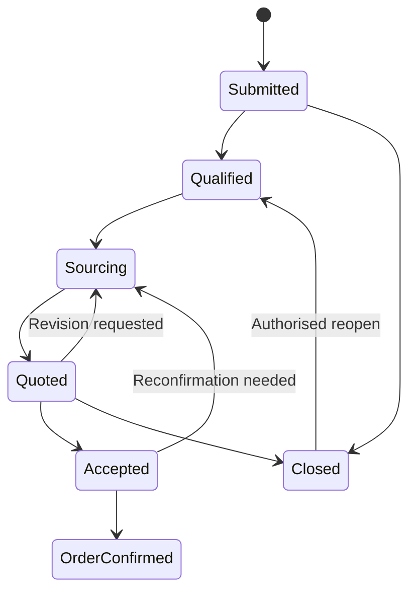
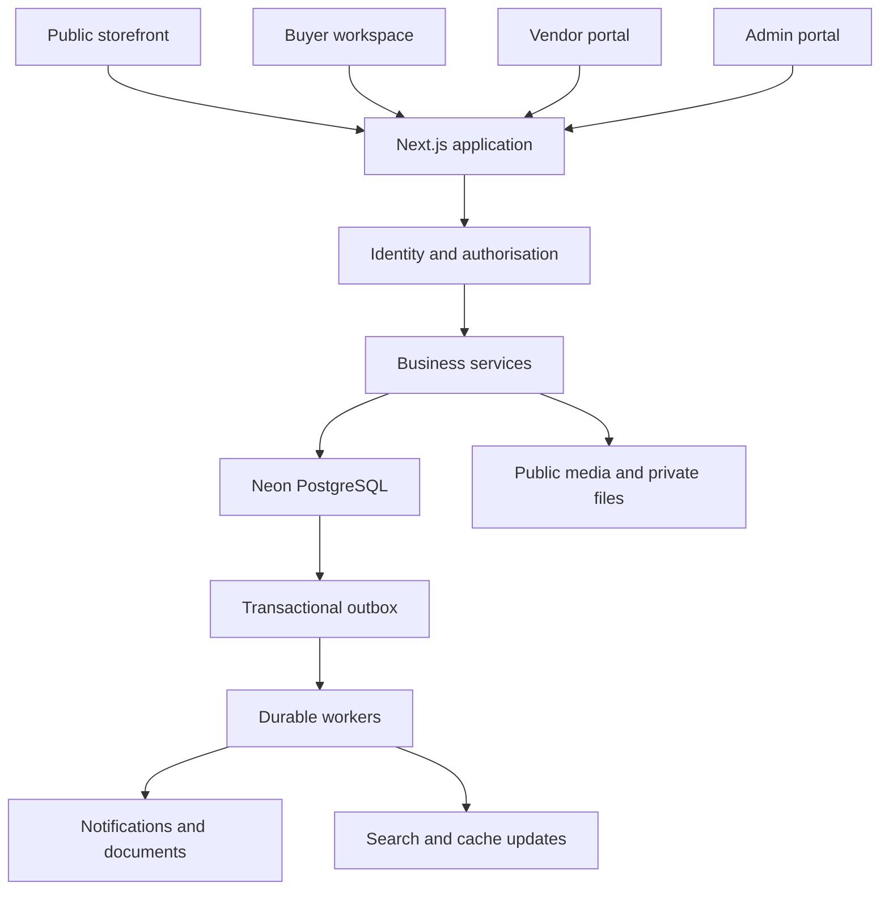
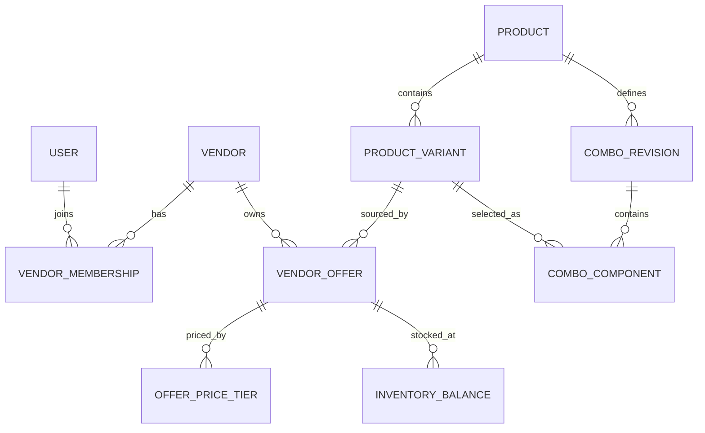
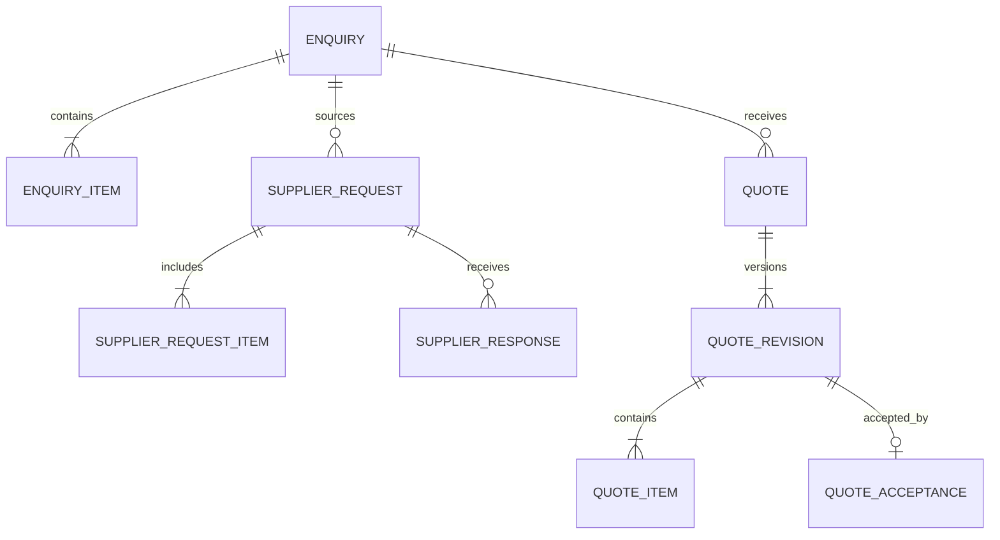

# Corporate Gifting Platform — Product and Technical Build Specification

**Prepared for:** Arun Mahendran  
**Version:** 1.0  
**Date:** 25 September 2026  
**Deliverable:** Implementation brief for the product, design, engineering, QA, content and operations teams  
**Working brand:** Corporate Gifting Hub — a placeholder, not a confirmed brand or domain  
**Database:** Neon PostgreSQL

> Build a premium B2B gifting discovery and procurement platform: customers discover individual gifts and curated combos, customise their requirements, and submit an enquiry cart; vendors maintain their own supply information; your team controls publication, sourcing, customer pricing, quotations and operational oversight.

This document specifies the product to build. It does not indicate that the website, integrations, infrastructure or security controls have already been implemented. Feature priorities, performance targets and timelines below are proposed planning decisions. Third-party documentation was checked on the date above; pin and validate compatible supported versions at implementation kickoff.

## Contents

1. [Recommended direction](#1-recommended-direction)
2. [Scope, assumptions and priorities](#2-scope-assumptions-and-priorities)
3. [Users, roles and permissions](#3-users-roles-and-permissions)
4. [Core product and vendor model](#4-core-product-and-vendor-model)
5. [Site architecture and routes](#5-site-architecture-and-routes)
6. [Storefront and discovery](#6-storefront-and-discovery)
7. [Product detail pages](#7-product-detail-pages)
8. [Combos and custom gift kits](#8-combos-and-custom-gift-kits)
9. [Enquiry cart and submission](#9-enquiry-cart-and-submission)
10. [Enquiries, supplier requests and quotations](#10-enquiries-supplier-requests-and-quotations)
11. [Vendor manager portal](#11-vendor-manager-portal)
12. [Admin and operations portal](#12-admin-and-operations-portal)
13. [UI, UX and accessibility](#13-ui-ux-and-accessibility)
14. [Recommended technology stack](#14-recommended-technology-stack)
15. [Application architecture](#15-application-architecture)
16. [Neon database design](#16-neon-database-design)
17. [Tenant isolation and access enforcement](#17-tenant-isolation-and-access-enforcement)
18. [Pricing, inventory and concurrency](#18-pricing-inventory-and-concurrency)
19. [API and integration contracts](#19-api-and-integration-contracts)
20. [Media and bulk imports](#20-media-and-bulk-imports)
21. [Search and intelligent discovery](#21-search-and-intelligent-discovery)
22. [AI features and safeguards](#22-ai-features-and-safeguards)
23. [Activity logging and analytics](#23-activity-logging-and-analytics)
24. [SEO and crawl management](#24-seo-and-crawl-management)
25. [Structured data and AEO](#25-structured-data-and-aeo)
26. [Security and data protection](#26-security-and-data-protection)
27. [Performance and reliability](#27-performance-and-reliability)
28. [Environments, deployment and recovery](#28-environments-deployment-and-recovery)
29. [Testing and acceptance criteria](#29-testing-and-acceptance-criteria)
30. [Delivery roadmap and staffing](#30-delivery-roadmap-and-staffing)
31. [Operating metrics and cost controls](#31-operating-metrics-and-cost-controls)
32. [Repository and developer handover](#32-repository-and-developer-handover)
33. [Implementation instructions for a coding team](#33-implementation-instructions-for-a-coding-team)
34. [Decisions to confirm before production](#34-decisions-to-confirm-before-production)
35. [Official documentation references](#35-official-documentation-references)

## 1. Recommended direction

Build a **custom, enquiry-led B2B platform using Next.js, TypeScript, Neon PostgreSQL and Drizzle ORM**, with a shared business-services layer serving the storefront, vendor portal and admin portal.

Use a **modular monolith** initially: one application codebase with well-separated business modules, plus durable background jobs and external media storage. Hundreds or a few thousand products do not, by themselves, justify microservices. The difficult parts are accurate supplier data, commercial workflows, security and catalogue quality.

The most important architectural decision is to separate these entities:

| Entity | Meaning | Example |
|---|---|---|
| Public product | The gift customers discover | Insulated Steel Bottle |
| Product variant | A specific colour, size or configuration | Navy, 750 ml |
| Vendor offer | One supplier's ability to supply that exact variant | Supplier A, SKU BOT-750-NV, MOQ 100 |
| Combo definition | A published, versioned selection of products and packaging | New Joiner Welcome Kit |
| Customer enquiry | A buyer's requirement, with a frozen submission snapshot | 250 welcome kits for Bengaluru |
| Supplier request | A private request to one vendor for selected requirements | Confirm 250 bottles, branding and dispatch date |
| Customer quotation | Your commercial proposal to the customer | Quote CGQ-2026-00125, revision 2 |

This structure allows multiple suppliers for the same gift, private vendor cost comparisons, product substitutions, consistent public pages and multi-vendor combos. A vendor's update must never automatically overwrite another vendor's offer or your approved public selling price.

### Intended commercial model

- Your business owns the customer relationship and sends the final quotation.
- Vendor managers manage their own supply offers, stock, lead times and product submissions.
- Customers submit requests for quotations; adding to cart does not buy or reserve stock.
- Vendor codes, procurement costs and margin calculations are private by default.
- Public pages use a platform product code that customers can reference.
- Online payment, vendor payouts and full marketplace settlement are later modules, if required.

### Primary outcomes

1. Customers can quickly find appropriate gifts by recipient, occasion, budget, quantity and delivery requirement.
2. Vendors can keep products and availability current without depending on your team for every edit.
3. Your team can turn enquiries into profitable, traceable quotations efficiently.
4. Every important business change has a reliable audit trail.
5. Public content is fast, accessible, indexable and useful to search engines and answer systems.

## 2. Scope, assumptions and priorities

### Initial assumptions

| Topic | Default for the build |
|---|---|
| Geography | India-first; destination serviceability by postcode and supported region |
| Currency | INR initially; all monetary records carry an ISO currency code |
| Language | English initially; translation-ready data structures |
| Customer type | Corporate buyers, HR teams, procurement teams, founders, agencies and event planners |
| Catalogue | Individual gifts, variants, curated combos and configurable kits |
| Transactions | Enquiry and quotation first; order recording after explicit confirmation |
| Price display | Admin-configurable indicative range, contextual starting price, or request-price mode |
| Tax | Per-item configured tax treatment; display inclusions clearly; confirm with your finance team |
| Vendor model | One vendor organisation may have several invited managers |
| Publication | Admin-controlled approval, with configurable trusted-vendor rules later |
| Inventory | Vendor-declared stock or production capacity, with freshness timestamps |
| Fulfilment | Vendor-direct, platform-consolidated or mixed, recorded on each sourcing plan |

### Priority definitions

- **P0 — launch requirement:** must work end-to-end before accepting real enquiries.
- **P1 — operational advantage:** build after the P0 foundation; some can fit into the first release if capacity permits.
- **P2 — scale and expansion:** introduce when usage and operations justify the complexity.

| Capability | Priority |
|---|---|
| Responsive catalogue, filters, product pages and fixed combos | P0 |
| Guest enquiry cart, submission, confirmation and admin inbox | P0 |
| Vendor onboarding, scoped accounts, products, stock and cost updates | P0 |
| Publication approval, revision history, private vendor codes | P0 |
| Supplier requests, quote versions, secure customer quote access | P0 |
| Audit trail, role enforcement, reliable background jobs and backups | P0 |
| Basic keyword search, metadata, sitemaps and relevant schema | P0 |
| Bulk import with validation and image processing | P0 |
| Rule-based gift finder, related products and alternative suggestions | P0 |
| Guided custom-combo builder, comparisons and saved shortlists | P1 |
| AI gift concierge, vendor content assistant and semantic search | P1 |
| Buyer organisation workspaces and internal approval chains | P1 |
| Samples, digital lookbooks, branded catalogue PDFs and artwork approvals | P1 |
| CRM, authorised WhatsApp notifications and vendor API feeds | P1 |
| Employee choice campaigns, payments, ERP, payouts and multi-currency | P2 |

Keep feature flags for P1/P2 capabilities. Avoid displaying inactive controls or dashboards backed by fabricated operational data.

### Initial scale envelope

Design and test against **10,000 public products, 50,000 variants, 100 vendor organisations and 250,000 product-media associations**. These are sizing assumptions, not traffic forecasts. The catalogue should remain usable with 500 products and grow without a data-model rewrite. Section 27 defines a separate traffic workload for load testing.

## 3. Users, roles and permissions

Use the word **Manager** only for a vendor's users in the interface. Your internal team should appear as Admin, Sales or Catalogue Editor to avoid confusion.

### Role model

| Role | Purpose |
|---|---|
| Visitor | Browse, search, compare locally and assemble a guest enquiry cart |
| Buyer | Access their own enquiries, quotes and saved selections after authentication |
| Buyer organisation approver — P1 | Review requests within an explicitly joined customer organisation |
| Vendor Manager | Manage permitted records for one or more vendor organisations they belong to |
| Vendor Owner — P1 | Invite vendor colleagues and manage vendor business settings |
| Platform Sales | Qualify leads, request supplier quotes and prepare customer quotations |
| Catalogue Editor | Curate public content, taxonomy and approved media |
| Platform Admin | Manage vendors, approval policies, pricing rules, enquiries and reporting |
| Platform Owner | Manage privileged roles, integrations and critical platform settings |

Launch may begin with Buyer, Vendor Manager, Platform Admin and Platform Owner. Implement granular permissions from the start so Sales and Editor roles can be activated without rewriting authorisation.

### Permission matrix

| Action | Visitor / Buyer | Vendor Manager | Platform Sales | Platform Admin / Owner |
|---|---|---|---|---|
| View published catalogue | Yes | Yes | Yes | Yes |
| View supplier cost or supplier SKU | No | Own vendor only | If granted procurement permission | Yes |
| Create product proposal | No | Own vendor | No | Yes |
| Change public canonical content | No | Propose revisions | No | Approve and publish |
| Update supplier stock and lead time | No | Own vendor only | No | Yes, with reason |
| Update supplier cost tiers | No | Own vendor only | No | Yes, with reason |
| Set public customer selling price | No | No | Draft quote price within policy | Yes |
| View enquiries | Own only | Assigned supplier requests only | Assigned or permitted enquiries | All |
| View customer contacts | Own | Only fields explicitly released | Permitted enquiries | Yes |
| Send final customer quote | No | No | Within approval thresholds | Yes |
| Read audit records | Own account activity, limited | Own vendor, redacted | Scope-specific | Authorised audit access |
| Export data | Own documents | Own permitted records | Permission-controlled | Permission-controlled |
| Manage platform roles | No | No | No | Owner; limited delegation if configured |
| Alter or delete audit history | No | No | No | No normal UI or application permission |

### Authorisation rules

- Enforce permissions on the server for every query, mutation, export, file URL and background job.
- Combine role checks, organisation membership, resource ownership and workflow state.
- An `admin` path is a navigation choice, not a security boundary.
- A vendor cannot access another vendor's resources by changing an ID, search parameter, export filter or upload key.
- Do not let users grant themselves roles or infer membership solely from an email domain.
- Require MFA for privileged platform users and vendor managers; provide account recovery and audited session revocation.
- Suspended membership takes effect on subsequent protected requests, including existing sessions.
- Emergency access uses a separate, time-bound, audited procedure; routine support does not impersonate customers silently.

## 4. Core product and vendor model

### Identifiers

| Identifier | Example | Visibility and rule |
|---|---|---|
| Product ID | UUID | Internal canonical identity; never changes with a slug |
| Public product code | CGH-P-001042 | Public and globally unique |
| Variant code | CGH-P-001042-NV-750 | Public if helpful; unique within the platform |
| Vendor code | VEN-0042 | Internal and globally unique; stable, never recycled |
| Vendor's product/SKU code | BOT750-NV | Private; unique within the vendor's agreed SKU namespace |
| Vendor offer ID | UUID | Internal identity of a specific supplier offer |
| Combo code | CGH-K-000125 | Public, distinct from component product codes |
| Enquiry number | CGE-2026-001254 | Customer-facing reference, not an authentication secret |
| Quote number | CGQ-2026-000824-R02 | Customer-facing, immutable revision identifier |

Admin global search must find products using any authorised identifier. Vendor search only resolves that vendor's own SKU and accessible platform codes. Vendor codes must not appear in public HTML, JSON-LD, browser API responses, image filenames or exported customer documents.

### Product data dictionary

| Group | Required fields | Optional or category-specific fields |
|---|---|---|
| Identity | Name, product code, kind, primary category, slug | Brand, manufacturer, actual GTIN/MPN when available |
| Content | Short summary, detailed description, key benefits, recipient suitability | Limitations, care instructions, approved FAQs |
| Classification | Categories, occasions, recipient types, use cases | Industry, style, material, verified sustainability tags |
| Physical attributes | Appropriate size/capacity/unit fields | Weight, package dimensions, colour, fabric, battery details |
| Commercial | Price mode, currency, MOQ basis, quantity increment | Public price tiers, sample terms, setup charges |
| Customisation | Available branding methods or explicit none | Print area, colours, engraving limits, artwork requirements |
| Availability | Supply mode and freshness policy | Ready stock, made-to-order capacity, lead time ranges |
| Logistics | Serviceable destinations and shipping assumptions | Fragile handling, assembly location, package count |
| Media | Hero image, alt text, ownership/usage status | Gallery, scale photo, packaging photo, video, spec sheet |
| Trust | Source of claims and review status | Certifications, evidence expiry, warranty and return terms |
| Governance | Lifecycle state, revision, owner, timestamps | Approver, publication schedule, rejection reason |

Use typed category attributes. A capacity value such as `750 ml` should be represented as number plus unit for filtering; long descriptions may contain explanatory text. Reserve JSONB for genuinely flexible secondary attributes with validated schemas.

### Example recipient and occasion taxonomy

- Recipients: new joiners, employees, clients, channel partners, executives, event attendees and remote teams.
- Occasions: onboarding, employee recognition, work anniversaries, conferences, festive gifting, client appreciation and company milestones.
- Categories: drinkware, stationery, bags, technology accessories, apparel, desk accessories, food hampers, wellness, home and lifestyle, and gift kits.
- Budget bands: below ₹500, ₹500–₹1,000, ₹1,000–₹2,500, ₹2,500–₹5,000 and above ₹5,000; define whether the basis includes tax and branding.

Avoid unsupported labels such as “eco-friendly”, “food safe”, “premium brand original” or “BIS certified”. Store evidence and permitted claim wording where relevant. Unknown facts remain unknown until verified.

## 5. Site architecture and routes

### Public routes

| Route | Purpose | Indexing default |
|---|---|---|
| `/` | Homepage and discovery | Index |
| `/gifts` | All individual gifts | Index |
| `/gifts/[slug]` | Product detail | Index when published |
| `/combos` | Curated combos | Index |
| `/combos/[slug]` | Combo detail | Index when published |
| `/categories/[slug]` | Category landing page | Index if curated and substantial |
| `/occasions/[slug]` | Occasion collections | Index if useful |
| `/recipients/[slug]` | Recipient collections | Index if useful |
| `/budgets/[slug]` | Curated budget collections | Index if pricing basis is clear |
| `/collections/[slug]` | Seasonal or campaign collection | Index selectively |
| `/corporate-gifting/[city]` | Actual regional service page | Index only with distinct content and service coverage |
| `/gift-finder` | Guided recommendations | Index explanatory landing content |
| `/build-a-kit` | Custom kit builder — P1 | Noindex interactive configurations |
| `/search` | Internal search results | Noindex |
| `/compare` | Product comparison — P1 | Noindex |
| `/enquiry-cart` | Enquiry selection and requirements | Noindex |
| `/enquiry/thank-you` | Submission confirmation | Noindex |
| `/guides/[slug]` | Buying and gifting guides | Index |
| `/about`, `/contact`, `/how-it-works` | Business identity and process | Index |
| `/become-a-vendor` | Vendor application | Index |
| `/privacy`, `/terms`, `/cookies` | Published policies | Normally index |

Slugs remain stable. On a justified slug change, create a permanent redirect and update links, canonical URL and sitemap. Do not include category in the product path if moving categories would change its URL.

### Private workspaces

| Workspace | Main routes |
|---|---|
| Customer | `/account`, `/account/enquiries`, `/account/quotes`, `/account/shortlists`, `/account/team` |
| Vendor manager | `/vendor/dashboard`, `/vendor/products`, `/vendor/inventory`, `/vendor/pricing`, `/vendor/requests`, `/vendor/imports`, `/vendor/activity`, `/vendor/settings` |
| Platform team | `/admin/dashboard`, `/admin/catalog`, `/admin/approvals`, `/admin/vendors`, `/admin/enquiries`, `/admin/quotes`, `/admin/content`, `/admin/analytics`, `/admin/audit`, `/admin/settings` |

Require authentication and authorisation. Apply `noindex` as an additional indexing control. Authentication, not robots.txt, protects private data.

## 6. Storefront and discovery

### Homepage

1. Clear value proposition: corporate gifts and kits selected around the buyer's occasion, quantity and budget.
2. Prominent search, followed by “Shop gifts”, “Explore combos” and “Find gifts for me”.
3. Fast entry points by occasion, recipient, budget and category.
4. Curated featured gifts and ready-to-customise combos.
5. A three-step explanation: shortlist → send requirements → receive a tailored quotation.
6. Custom branding and fulfilment explanation grounded in actual capabilities.
7. Verified client examples, case studies or testimonials only when available and approved.
8. A short procurement FAQ and visible contact path.

Do not delay access with forced login, full-screen lead capture or an automatic chat popup.

### Product listing pages

- Show an informative card: image, product title, public code, recipient/occasion cue, price basis, MOQ and lead-time summary.
- Support 24 products per page initially, with responsive image loading and proper pagination links.
- Optional “Load more” enhances the paginated route; the catalogue remains discoverable without JavaScript.
- Persist filters, sort and page in shareable URL parameters.
- Provide clear selected-filter chips, counts and “Clear all”.
- Keep sorting stable with a deterministic ID tie-breaker.
- Sort options: relevance, curated picks, newly added, price and lead time where comparable data exists.
- Sponsored placements, if introduced, must be visibly identified and stored separately from organic ranking.

### Filters

Category, occasion, recipient, budget per gift, requested quantity, minimum order quantity, delivery location, required-by date, branding method, material, colour, stock mode, verified sustainability attributes and combo size.

Budget filters must use the same price basis displayed on the cards. If a customer enters 100 units, do not filter using a price available only at 1,000 units. Products with unknown prices should have an explicit inclusion option and should not be silently ranked as cheapest.

### Search experience

- Autocomplete for product names, category names, public codes and popular approved terms.
- Synonyms such as “joining kit”, “welcome kit” and “onboarding kit”.
- Typo tolerance and clear fallback suggestions.
- Search by natural-language need in P1, with recognised filters shown to the user.
- Zero-results page suggests which constraints can be relaxed and offers a sourcing enquiry.
- Preserve hard constraints. Never silently increase the budget or ignore a deadline.

### Buyer utility features

- Share a shortlist with a controlled read-only link — P1.
- Compare up to four products on desktop and two side-by-side on narrow screens — P1.
- Download an accessible, branded selection PDF — P1; no supplier costs or codes.
- Save selections to an account without making account creation necessary for the first enquiry.
- Request a sample with explicit price, shipping and refund/adjustment terms — P1.
- Allow “I could not find the gift” briefs without requiring a product selection.

## 7. Product detail pages

### Above the fold

**Desktop:** image gallery on the left and a sticky purchase-requirements panel on the right.  
**Mobile:** title, gallery, commercial summary, variant selection and a persistent but unobtrusive “Add to enquiry” action.

Show:

- Product title and public product code.
- Concise explanation of what makes the item useful.
- Gallery with alternate angles, scale and packaging where available.
- Variant selectors with text labels in addition to colour swatches.
- Price display and exact basis: quantity, branding, tax and shipping inclusions.
- MOQ, quantity increments and quantity selector.
- Branding options and relevant add-on costs or quote requirements.
- Lead-time range and the conditions that start the clock, such as artwork approval.
- Destination/serviceability check.
- Primary CTA: **Add to enquiry**.
- Secondary CTA: **Ask about this gift** or **Request a sample**, if enabled.

### Below the fold

| Section | Required detail |
|---|---|
| Overview | Accurate description, benefits and intended use |
| Who is this for? | Suitable recipient groups and reasons |
| Best occasions | Onboarding, conferences, festive gifting or other relevant occasions |
| Specifications | Material, dimensions, capacity, colour, weight, packaging and included items |
| Branding | Method, placement, area, artwork formats, setup and minimum quantities |
| Quantity and pricing | Applicable tiers, inclusions and estimate limitations |
| Delivery | Destination coverage, production and dispatch assumptions |
| Quality and care | Warranty, care, sample availability, evidence-backed claims |
| FAQs | Genuine product-specific questions with factual answers |
| Related options | Alternatives, companion gifts and combos containing this product |

### Required commercial wording

An example only, to be replaced by approved data:

> From ₹650 per gift for 250 units. Excludes GST, custom branding and shipping. Final price and delivery schedule will be confirmed in your quotation.

If the underlying figure is only a loose estimate, label it **Indicative budget**, not a firm selling price. If pricing is unknown, use **Request a quote**; never display ₹0.

### Unavailable and outdated data

- Temporary unavailability: retain useful product content and offer alternatives.
- Stale vendor stock: display “Availability to be confirmed” and remove unsupported immediate-delivery claims.
- Discontinued product: keep a helpful page where appropriate or redirect only to a genuinely equivalent replacement.
- Missing image: use a neutral designed placeholder with no invented visual representation.
- Food, apparel and electronics receive their own meaningful attributes; do not force every category into identical specifications.

## 8. Combos and custom gift kits

### Combo types

| Type | Behaviour | Priority |
|---|---|---|
| Fixed combo | Specific components and quantities with approved variants | P0 |
| Configurable combo | Choose one component from each approved group | P1 |
| Build-your-own kit | Add permitted products and packaging within constraints | P1 |
| Bespoke brief | Buyer gives recipient, budget and occasion; team proposes a kit | P0 |

Every fixed combo must have a versioned bill of materials: component variant, units per kit, packaging, insert, assembly service and branding configuration. Nested combos are disabled initially to avoid cycles and unclear quantities.

### Combo detail page

- Hero photo of the actual kit or clearly labelled representative composition.
- Item-by-item list with quantity and specifications.
- “Who is it for?” and the occasion it serves.
- Price per kit, MOQ in kits, available customisations and fulfilment lead time.
- Packaging choices, dimensions and branding options.
- Component substitutions with approval requirements.
- Clear explanation of whether the kit is assembled together or dispatched separately.

### Builder rules

1. Ask for occasion, recipient count, budget, destination and required-by date.
2. Select packaging size before or alongside components.
3. Restrict selections to approved compatible products.
4. Track per-kit cost and total project estimate separately.
5. Validate packaging fit, weight, quantities, branding compatibility and prohibited combinations.
6. Flag food allergies, shelf-life or fragile handling using verified product information where relevant.
7. Check component MOQ at the required aggregate component quantity.
8. Save configuration as a versioned record; do not manufacture a public SEO page for every combination.
9. Submit a complete component snapshot with the enquiry.
10. No component substitution after quotation acceptance without recorded customer approval.

### Multi-vendor sourcing

Your admin can choose a supplier for each component privately. A vendor sees only the components and service requirements assigned to it. Define who receives components, who assembles kits, who owns quality checks, and the destination of every shipment. Consolidation, packaging, assembly and freight must be costed explicitly.

## 9. Enquiry cart and submission

The cart is a structured procurement brief. Label it **Enquiry cart** throughout the interface.

### Cart line data

- Product or combo ID and selected revision.
- Selected variant and customisation configuration.
- Required quantity and unit of measure: individual items or kits.
- Requested branding, artwork reference and special instructions.
- Indicative unit price/range, inclusions and calculation timestamp.
- Desired delivery date and location allocation if different by line.
- Validation results: MOQ, stock freshness, serviceability and lead-time conflicts.

Merge lines only when product, variant, configuration and fulfilment requirements match. Two bottles with different engraving or deadlines must remain separate lines.

### Cart behaviour

- Guest cart survives reloads using a first-party session identifier and server-side cart.
- Store no personal contact details or secret access tokens in client-readable local storage.
- Support quantity editing, remove, duplicate, move to shortlist and continue browsing.
- Recalculate estimates on the server; never trust submitted prices.
- Preserve the selection when a login or verification step occurs.
- On account sign-in, merge guest and saved carts with a visible conflict resolution step.
- Recheck changed prices and unavailable products before submission and explain what changed.
- Unknown costs remain “To be confirmed” rather than contributing zero to a misleading total.
- Show a separately labelled known subtotal if a fully priced estimate is unavailable.

### Enquiry form

**Required:** contact name, one verified contact channel, company/organisation name, recipient quantity, delivery city/postcode, and acknowledgement of enquiry processing. A non-corporate email is allowed; it should not exclude small-business buyers.

**Requested where relevant:** work email, phone, designation, occasion, budget basis, required-by date or flexibility, branding needs, shipping model and notes. Choose one contact method for initial verification; do not force verification of both email and phone.

**Optional:** company website, GSTIN, procurement documents, logo and additional delivery locations. Full employee address lists are not collected during initial enquiry.

Marketing consent is separate, optional and unticked. Transactional confirmation is handled according to the published enquiry policy, not treated as permission for marketing.

### Submission sequence

1. Validate server-side inputs and anti-abuse signals.
2. Verify the contact channel through a short, resumable flow; preserve the cart.
3. Revalidate products, variants, MOQ and current published availability.
4. Create enquiry header, immutable line snapshots, initial history, audit event and outbox events in one transaction.
5. Return the enquiry number and a safe confirmation summary immediately after commit.
6. Deliver customer acknowledgement and internal notifications asynchronously.
7. Clear or archive the submitted cart only after successful creation.

Use an idempotency key scoped to the guest session or authenticated buyer. Repeated clicks, retries and network reconnects must return the same enquiry, not generate duplicates. A reused key with different content returns a conflict.

### After submission

- Confirmation shows the enquiry number, selected items and expected next step.
- Response-time commitments come from configurable operating hours and actual team capacity.
- A secure account or expiring one-time access flow provides progress and quote access.
- The visible enquiry number alone never grants access.
- Email failure must not roll back or lose a successfully created enquiry.

## 10. Enquiries, supplier requests and quotations

### Customer enquiry state machine



Keep closed reasons separately: spam, duplicate, no response, cancelled, lost to competitor, budget mismatch or unavailable requirement. Every transition records who, when, reason and permitted previous state.

**Accepted is not automatically Order Confirmed.** Order confirmation requires the configured commercial checks, such as accepted terms, supplier reconfirmation, artwork approval, purchase order or deposit where applicable. The precise contract and payment rules must be agreed before launch.

### Admin enquiry workspace

- Owner assignment, priority, due date and response SLA.
- Company/contact profile, source attribution and enquiry history.
- Item-level requirements, budgets, delivery constraints and documents.
- Internal notes kept separate from customer-visible messages.
- Supplier shortlist and comparisons of cost, MOQ, lead time, stock freshness and quality history.
- Vendor requests and responses, with partial responses supported.
- Tasks and reminders with escalation for overdue work.
- Duplicate detection by contact, company, item similarity and time window; a user confirms merging.
- Kanban and table views with saved filters.

### Supplier requests

One enquiry may generate multiple supplier requests. Each contains only the assigned line requirements, needed date, delivery region, branding specification and response deadline. Release exact customer identity or artwork only when necessary and authorised.

Supplier responses include unit cost tiers, setup charges, tax treatment, packaging/assembly cost, freight assumptions, ready quantity, production capacity, dispatch date, validity date and substitutions. Responses are versioned. Supplier declines and expiries are valid outcomes.

### Quote builder

1. Select approved source offers and freeze the supplier response versions.
2. Calculate procurement cost, fulfilment costs, margin and customer selling price.
3. Show item-level and overall margin to authorised platform staff.
4. Apply commercial approval rules for discounts, low margins or exceptional terms.
5. Preview the exact customer-facing document.
6. Issue an immutable quote revision with validity date and a complete price/terms snapshot.
7. Track sent, viewed, revision requested, accepted, rejected, expired and superseded states.

Each quote contains recipient/company, line items, public codes, selected options, quantities, price inclusions, tax breakdown, shipping and setup charges, totals, validity, lead-time assumptions, delivery terms, payment terms and quote contact. Quotes are not labelled tax invoices.

An issued quote is never edited in place. A revised quote supersedes the prior version. Acceptance is authenticated or verified, transactionally checks the current valid revision and records the accepted document hash and terms version. An expired or superseded quote cannot be accepted through an old browser tab.

### P1 procurement features

- Buyer team review and approval before accepting a quote.
- Sample request, dispatch and feedback status.
- Artwork proof versions and explicit approval before production.
- Purchase-order upload and association.
- Multi-location shipping plan with protected recipient files.
- Reorder from a past accepted quote, with fresh prices and availability.
- Basic order milestones: sourcing, artwork, production, quality check, dispatch and delivery.

## 11. Vendor manager portal

### Dashboard

Show actionable cards: supplier requests awaiting response, stale stock records, low-stock offers, rejected submissions, products missing images, price validity expiries and overdue tasks. Every card opens the relevant filtered list.

### Vendor onboarding

- Admin invitation or public application followed by approval.
- Legal/display name, contact details, vendor code and service categories.
- Warehouse/dispatch locations, serviceable regions and typical lead times.
- Business and relevant product verification documents stored privately.
- Vendor terms acknowledgement and catalogue image/content permissions.
- Approved user memberships and MFA setup.
- Onboarding checklist with responsibility and completion states.

Bank details are unnecessary for an enquiry-only launch. If introduced for payouts, isolate their permissions and retention from ordinary catalogue management.

### Product and offer management

- Create a new product proposal or request association with an existing canonical product.
- Add variants, images, supplier SKU, MOQ, quantity increments and cost tiers.
- Maintain available quantity, supply mode, production lead time and stock timestamp.
- Enter branding capabilities, sample terms and dispatch locations.
- Clone an existing own-vendor offer as a draft.
- Bulk update own inventory and prices with preview and validation.
- See publication status and actionable admin feedback.
- Save drafts and resume editing; show unsaved changes clearly.
- View own change history without seeing competitor data.

### Publishing and update rules

| Change | Default treatment |
|---|---|
| New product, new public image or description | Admin review |
| Material, certification or brand claim | Review with supporting evidence |
| Vendor's own procurement cost | Save as a new internal offer revision; flag affected quotes and margins |
| Public selling price | Platform-controlled approval |
| Own stock quantity | Immediate internal update after validation, with audit and cache invalidation |
| Stock increase with unusual magnitude | Anomaly flag; optional verification policy |
| Longer lead time or offer paused | Immediate effect on sourcing eligibility |
| Proposed replacement component | Admin review; customer approval if an accepted quote is affected |

The existing approved public product remains visible while a proposed content revision is under review, unless a safety, accuracy or availability issue requires pausing it.

### Vendor lifecycle

Application → verification → active → paused/suspended → archived. Suspension prevents new sourcing and vendor mutations immediately, but preserves historic quotes and audit records. Show affected open requests to the admin for reassignment.

## 12. Admin and operations portal

### Modules

| Module | Required capability |
|---|---|
| Dashboard | Leads, response SLA, quote pipeline, catalogue health and exceptions |
| Catalogue | Products, variants, bundles, taxonomy, media, completeness and publication |
| Approval inbox | Diffs, evidence, reviewer assignment, approve/reject with reason |
| Vendors | Organisations, codes, users, verification, serviceability and performance |
| Commercial rules | Price books, margin floors, quote approvals and shipping assumptions |
| Enquiries | Assignment, qualification, tasks, supplier requests and communication history |
| Quotes | Versioning, customer preview, approval, issue, expiry and acceptance |
| Content | Landing pages, guides, FAQs, redirects, metadata and internal links |
| Campaigns — P1 | Seasonal collections, curated product sets and scheduled visibility |
| Imports and exports | Job progress, validation errors, permissions and downloadable reports |
| Reports | Funnel, product demand, vendor responsiveness and quote margins |
| Audit | Searchable business changes, access events and exports |
| Settings | Roles, integrations, templates, retention policies and feature flags |

### Approval inbox UX

Display previous and proposed values, the actor, supporting media, affected products/combos/quotes, and any automated quality checks. Allow individual field feedback. Bulk approval is permission-controlled and excludes changes requiring separate evidence.

### Operational intelligence

- Flag vendor cost changes that make a published price unprofitable.
- Detect frequently requested products with poor availability.
- Identify searches with no useful results as sourcing opportunities.
- Flag stale stock before a sales executive promises delivery.
- Rank supplier options by suitability, with cost, freshness and reliability visible separately.
- Surface outstanding dependencies: waiting for vendor, customer, artwork, sample or finance.
- Generate a daily operational digest from actual records.

Reports must distinguish enquiry value, quoted value, accepted value and recognised revenue. Do not report a cart estimate as a sale.

## 13. UI, UX and accessibility

### Visual direction

Use a premium B2B catalogue style: clean layouts, large product photography, clear typography and restrained accents. The interface should make a procurement decision feel organised and easy.

Suggested starting tokens, to be adjusted during design:

| Token | Starting value |
|---|---|
| Background | Warm off-white `#F8FAF9` |
| Surface | White `#FFFFFF` |
| Primary text | Deep slate `#172B3A` |
| Brand/action | Deep teal `#0F5B52` |
| Decorative accent | Muted gold `#B98239`; not default small-text colour |
| Borders | Soft grey `#DDE5E3` |
| Typography | Self-hosted, licensed sans-serif; two weights initially |
| Spacing | Consistent 4/8 px scale |
| Corner radius | 8–12 px for controls and cards |
| Content width | Approximately 1,280 px maximum with responsive gutters |

Validate actual text and UI contrast. Do not assume that a colour token is accessible in every pairing.

### Responsive behaviour

- Design from a 360 px viewport upward; also test narrow 320 px layouts where applicable.
- Product grids: two compact columns on suitable phones, three on tablets and four on wide desktops; permit one column where content requires it.
- Mobile filters open in an accessible sheet with an explicit apply action and visible result count.
- Desktop filters remain discoverable without consuming most of the page.
- Admin tables support column selection, sticky identifiers and deliberate horizontal scrolling; use card summaries for key mobile workflows.
- Vendor stock updates, photo upload and supplier responses must work well on a phone.
- Sticky CTAs must not cover inputs, validation messages, cookie choices or mobile browser controls.

### Required component library

Header, navigation, search combobox, breadcrumbs, product card, price-basis label, variant picker, filter panel, pagination, gallery, quantity input, availability badge, enquiry drawer, stepper, empty state, skeleton, error banner, toast, confirmation dialog, data table, status timeline, revision diff, upload queue and permission-aware action menu.

### Interaction quality

- Use explicit labels, inline help and field-level validation.
- Keep entered data after errors and provide safe retry paths.
- Announce cart changes and errors to assistive technology.
- Support keyboard navigation, visible focus and escape-to-close behaviour.
- Use text and icons alongside colour for status.
- Respect reduced motion and avoid auto-advancing carousels.
- Aim for WCAG 2.2 AA; include manual keyboard and screen-reader checks.
- Prefer touch targets of at least 44 × 44 px for primary actions.
- Do not use urgency counters, invented scarcity, invented reviews or unverified logos.

### Required design deliverables

Responsive screens for homepage, listing, product, combo, cart, enquiry form, success, customer quote, vendor dashboard, product editor, inventory table, supplier response, admin enquiry, quote builder and approval diff. Include loading, empty, validation, permission-denied and failure states for the critical flows.

## 14. Recommended technology stack

The following is a deliberate default stack, not a requirement to install every optional service immediately. Commercial plans, regional availability and integration compatibility must be checked at procurement.

| Layer | Recommendation | Reason and boundary |
|---|---|---|
| Web framework | Next.js App Router on a supported stable release | Server-rendered public pages and shared authenticated application |
| Language/runtime | TypeScript strict mode; supported Node.js LTS | Shared contracts and predictable runtime |
| UI | React, Tailwind CSS, shadcn/ui and accessible Radix primitives where appropriate | Consistent, customisable components |
| Forms/validation | React Hook Form and Zod | Reuse validation contracts on client and server |
| Server-state UI | TanStack Query where interactive workspaces need it | Background refetch and mutation state; avoid duplicating server-rendered state unnecessarily |
| Database | Neon PostgreSQL | Relational catalogue, vendor offers and transactional workflows |
| ORM/migrations | Drizzle ORM and reviewed SQL migrations | Typed queries with explicit relational constraints |
| Database driver | `pg` / node-postgres in the Node runtime with Neon pooled connection | Interactive transactions for audited business operations; validate deployment lifecycle |
| Identity | Clerk for authentication, MFA and invitations | Application membership/permissions remain authoritative in Neon |
| Background jobs | Inngest | Durable workflows, retries and scheduling; paired with a database outbox |
| Public media | Cloudinary | Image delivery/transformation behind a media-provider adapter |
| Private files | Amazon S3 with private buckets and signed access | Artwork, vendor documents, quotes, imports and exports |
| Search at launch | PostgreSQL full-text search plus `pg_trgm` | Good initial fit for a structured catalogue |
| Semantic retrieval — P1 | `pgvector` in Neon, after extension availability is verified | Optional semantic recall; not the source of commercial truth |
| Dedicated search — later | Typesense, if relevance/facet latency warrants it | Search projection only; Neon remains authoritative |
| Rate limiting | Managed Redis, such as Upstash | Distributed counters; no critical commercial record stored solely here |
| Transactional email | Resend behind a notification adapter | Templates, delivery events and retry handling |
| Product analytics | PostHog with explicit event allowlist | Funnels and usage; replay/autocapture disabled initially |
| Error monitoring | Sentry with sensitive-data scrubbing | Client/server exceptions and trace correlation |
| Hosting | Vercel for the Next.js application | Managed deployment and preview workflow; match region to database |
| CI | GitHub Actions | Lint, types, tests, migrations and security checks |
| Tests | Vitest, Playwright, axe and k6 or equivalent | Business rules, workflows, accessibility and load |
| Optional AI | A server-side model-provider adapter | Structured tool calls, cost limits and replaceable provider |

Clerk documents organisation primitives, and Inngest documents retriable workflow steps; the application still needs its own resource authorisation and idempotency rules. [S8], [S9]

### Version policy

At kickoff, record actual versions of Next.js, React, Node, Drizzle, database driver and PostgreSQL in an architecture decision record. Use stable supported versions, a committed lockfile and automated update PRs. Do not specify a floating `latest` version in production or assume that a provider supports every upstream PostgreSQL release or extension.

### Why this stack fits

- Strong relational modelling for suppliers, offers, quotes, revisions and audit events.
- Server rendering and controlled caching for discoverable public pages.
- One TypeScript codebase across public and private experiences.
- Independent storage for images and private files, keeping the database focused on structured data.
- A path to dedicated search or separate services after measured need.

Avoid Kubernetes, a custom authentication implementation, a separate graph database and multiple backend frameworks for the first release. If the team later needs a separately deployed API, extract established modules behind the same contracts; do not duplicate business logic.

## 15. Application architecture



### Business modules

`identity`, `vendors`, `catalog`, `media`, `pricing`, `inventory`, `combos`, `carts`, `enquiries`, `supplier-requests`, `quotes`, `content`, `search`, `notifications`, `audit`, `analytics` and `integrations`.

Each module owns its validation, permissions, service methods, repository queries and events. UI handlers should be thin. Use the same service method from server actions, route handlers and background jobs to prevent inconsistent rules.

### Render and cache policy

| Surface | Policy |
|---|---|
| Published product content | Server-rendered and explicitly cached; invalidate on approved publication |
| Public category and collection | Server-rendered with paginated data and tagged invalidation |
| Public stock/price summary | Short bounded freshness; authoritative revalidation at enquiry and quotation |
| Search | Query-specific cache only where safe; exclude private fields |
| Guest cart | Private, session-bound; never shared-cache |
| Customer/vendor/admin workspace | Authenticated; private data excluded from shared caching |
| Quote and private files | Private/no-store with access checks |

Next.js supports time-based and on-demand revalidation. Configure caching deliberately for the pinned release rather than relying on remembered framework defaults. A publication event must invalidate both affected product and collection representations. [S5]

Cache only a purpose-built `PublicProductDTO`; never cache a broad supplier join and then remove private fields in the browser. Private responses use appropriate cache-control headers, and sign-out clears client state associated with the previous user.

### Reliable asynchronous processing

Business transaction → outbox row → durable dispatcher → job → delivery record. A worker may receive an event more than once. Each side effect uses an event ID and idempotency record. Record failed attempts, backoff, terminal failure and manual replay. Use leases when claiming jobs so two dispatchers cannot process the same row concurrently without detection.

Do not depend on a fire-and-forget network call after returning an HTTP response. Do not hold a database transaction open while sending email, generating PDFs, invoking an LLM or waiting for a supplier API.

## 16. Neon database design

### Modelling conventions

- UUID primary keys; stable public references in separate unique columns.
- UTC `timestamptz` for events; display operational dates in Asia/Kolkata by default.
- Integer minor units for money, such as paise, plus currency. Serialise large integer values safely in JSON.
- Decimal arithmetic for rates and derived amounts; round using documented finance rules.
- Positive integer quantities initially. Represent unit of measure explicitly.
- `created_at`, `updated_at`, `created_by`, `updated_by`, `row_version` on mutable business records.
- Foreign keys and unique/check constraints in addition to application validation.
- Separate immutable revisions from mutable workflow headers.
- Use archive states instead of deleting records referenced by enquiries or quotes.
- Keep personal data in designated fields so retention and deletion workflows can identify it.

### Entity relationships



For combos, `PRODUCT.kind = combo`; components reference individual product variants. Configurable groups use additional group/options tables, not cyclic product references.



### Identity and vendor tables

| Table | Principal fields and constraints |
|---|---|
| `users` | Auth-provider subject unique, display name, verified contact references, status |
| `platform_roles`, `permissions`, `role_permissions`, `user_platform_roles` | Explicit platform grants; audited modifications |
| `vendors` | Unique vendor code, legal/display name, status, service settings, contact reference |
| `vendor_memberships` | Vendor ID, user ID, role, status; unique vendor/user pair |
| `vendor_invitations` | Vendor, intended recipient, permission scope, hashed token, expiry, used/revoked timestamps |
| `vendor_locations` | Vendor, warehouse/dispatch name, address reference, timezone |
| `vendor_documents` | Vendor, document type, private asset ID, verification status, expiry |
| `buyer_organisations`, `buyer_memberships` | P1 corporate buyer workspaces with explicit invitations |
| `contacts`, `addresses`, `consent_records` | Purpose-specific personal data and consent version/history |

### Catalogue tables

| Table | Principal fields and constraints |
|---|---|
| `products` | Public code, kind, canonical slug, lifecycle, current published revision ID |
| `product_revisions` | Product, revision number, content payload, review status, author, approver, timestamps |
| `product_variants` | Product, unique platform SKU, typed option combination, status, row version |
| `variant_options`, `variant_option_values` | Controlled colour, size and capacity options |
| `categories`, `product_categories` | Hierarchy, canonical taxonomy slug, product association |
| `taxonomy_terms`, `product_terms` | Recipient, occasion, material and use-case associations |
| `attribute_definitions`, `product_attribute_values` | Type/unit/category validation for filterable attributes |
| `assets`, `product_media` | Asset ownership, visibility, scan status, dimensions, alt text, sort order |
| `product_claims` | Claim wording, evidence asset/source, verification state, expiry |
| `product_faqs` | Approved question, answer, source revision and order |
| `product_proposals` | Vendor-owned draft submission or proposed association with canonical product |
| `slug_redirects` | Unique old path, target path, reason; no redirect loops |

### Supply, pricing and inventory tables

| Table | Principal fields and constraints |
|---|---|
| `vendor_offers` | Vendor, variant, supplier SKU, status, MOQ, increment, supply mode, currency, revision |
| `vendor_offer_revisions` | Immutable offer terms and cost snapshot with validity and author |
| `offer_price_tiers` | Offer revision, lower/upper quantity, procurement unit cost; non-overlapping tiers |
| `public_price_books`, `public_price_entries` | Admin-owned selling-price/estimate rules, context and effective dates |
| `branding_options`, `branding_rates` | Permitted method, area, setup charge, per-unit charge, MOQ and compatibility |
| `inventory_balances` | Offer, vendor location, on-hand, reserved, safety stock, source and observed timestamp |
| `inventory_movements` | Append-only quantity delta or reconciliation adjustment, reason, reference and actor |
| `production_capacity` | Offer/location, capacity period, units, committed units and verification timestamp |
| `serviceability_rules` | Vendor/offer, destination rules, transit assumptions and exclusions |
| `price_change_reviews` | Impacted public listings/quotes, policy triggers, disposition and reviewer |

Supplier SKU uniqueness is normally `(vendor_id, supplier_sku)`. If a vendor reuses a SKU across variants, reject ambiguity during onboarding/import or define a documented composite key. Never silently overwrite one variant with another.

### Combo tables

| Table | Principal fields and constraints |
|---|---|
| `combo_revisions` | Combo product, revision, fixed/configurable type, packaging and assembly settings |
| `combo_components` | Combo revision, component variant, quantity per kit, required/optional |
| `combo_option_groups`, `combo_options` | P1 selection limits, eligible variants and defaults |
| `combo_configurations` | User/session-owned selected composition and validation snapshot |
| `packaging_specs`, `packaging_compatibility` | Dimensions, capacity/weight rules and verified compatibility |
| `sourcing_plans`, `sourcing_allocations` | Private selected offers, quantities, destinations and cost assumptions |

### Enquiry and commercial tables

| Table | Principal fields and constraints |
|---|---|
| `carts`, `cart_items` | User or hashed guest ownership, configuration, quantity, expiry, row version |
| `enquiries` | Unique reference, contact/buyer, status, owner, priority, date and budget basis |
| `enquiry_items` | Product references plus immutable submitted description/configuration/estimate snapshot |
| `enquiry_destinations` | Initial destination requirements and per-line allocation |
| `enquiry_history`, `enquiry_notes`, `tasks` | State changes, visibility-scoped notes and follow-ups |
| `supplier_requests`, `supplier_request_items` | Vendor-scoped request with selected requirements and due time |
| `supplier_responses`, `supplier_response_items` | Versioned response costs, quantity, lead time, validity and exclusions |
| `quotes` | Enquiry, quote family reference and current revision pointer |
| `quote_revisions` | Revision, currency, totals, validity, immutable terms snapshot, document hash and status |
| `quote_items` | Immutable line description, options, quantity, cost access scope, selling price and tax breakdown |
| `quote_approvals`, `quote_acceptances` | Approver/acceptor, exact revision, timestamp, verification and terms version |
| `orders`, `order_items`, `order_milestones` | Optional commercial confirmation record; separate from payment processing |
| `artwork_proofs`, `sample_requests` | P1 proof versions, approval and sample workflow |

Store supplier cost snapshots separately from the customer-visible quote projection. A PDF generator should receive a customer DTO, not the full database object.

### Supporting tables

`content_pages`, `collections`, `collection_products`, `audit_events`, `security_events`, `outbox_events`, `processed_events`, `notification_deliveries`, `webhook_receipts`, `idempotency_keys`, `import_jobs`, `import_rows`, `export_jobs`, `ai_runs`, `product_embeddings`, `feature_flags`, `retention_jobs` and `system_settings`.

High-volume behavioural analytics belong primarily in the analytics system. Keep only necessary business aggregates in Neon.

### Essential constraints and indexes

- Unique public codes, slugs and enquiry references; references generated without race-prone `MAX + 1` logic.
- Unique quote-family/revision number and one acceptance for the effective quote revision.
- Composite foreign keys or equivalent constraints prevent mixing a vendor ID with another vendor's offer/location.
- Quantity and money bounds; valid tier ranges and date intervals.
- Parent/child constraints prevent orphaned media, variant and supplier-request records.
- B-tree indexes for `(vendor_id, status, updated_at)`, `(owner_id, status, created_at)` and `(product_id, status)`.
- Index foreign keys used in joins, with measured query plans.
- GIN full-text index on a purpose-built published search document; trigram indexes on selected name/code fields.
- Audit indexes for `(entity_type, entity_id, occurred_at)` and `(actor_id, occurred_at)`.
- Outbox index on pending status and `available_at`.
- Partition audit/event tables by time only when size and maintenance needs justify it.
- Partial unique indexes must match archival rules; do not reuse vendor or historical quote codes.

### Neon connection and environment rules

Neon uses transaction-mode pooling. Requests must not rely on session state surviving across pooled transactions. Use the pooled endpoint for application traffic, keep client pools small and bounded for the hosting environment, and use a separate direct connection for migrations/administrative operations where required. [S1]

The recommended Node driver supports the interactive transactions required here. If the team instead selects Neon's serverless driver, validate the ORM adapter: HTTP supports non-interactive transaction batches; WebSocket `Client`/`Pool` supports session and interactive transaction patterns. Do not assume interchangeable behaviour. [S2]

Use a separate staging project and schema-only or sanitised development branches. Schema-only branching helps avoid copying customer data into previews. Clean up temporary branches and isolate credentials. [S3]

## 17. Tenant isolation and access enforcement

The public catalogue is shared, while vendor offers, requests, documents and membership data are vendor-scoped. Customer enquiries and quote access have their own ownership scopes; do not treat every record as belonging to one universal tenant.

### Layered control

1. Authenticate the actor server-side.
2. Resolve active platform permissions or vendor/customer membership from trusted application records.
3. Apply ownership and workflow checks in the service.
4. Scope database queries explicitly.
5. Apply PostgreSQL row-level security to sensitive tenant tables as defence in depth.
6. Return a field-allowlisted DTO.

PostgreSQL RLS is normally bypassed by table owners and roles with `BYPASSRLS`. Use non-owner application roles without bypass privileges, default-deny policies, and `FORCE ROW LEVEL SECURITY` where appropriate. Policies need both read/update visibility and write checks. Migration credentials must not be the runtime credentials. [S4]

### Transaction context

For protected vendor operations, use a single checked-out connection and explicit transaction. Resolve membership first, then set transaction-local context with parameterised `set_config`, execute protected queries, and commit/rollback on that same connection. A simplified pattern:

```ts
// Illustrative service contract, not a complete authentication implementation.
const actor = await requireAuthenticatedActor();
const scope = await requireActiveVendorPermission(actor, vendorId, "offer:update");

await withTransaction(async (tx) => {
  await tx.setLocalContext({ actorId: actor.id, vendorId: scope.vendorId });
  const offer = await tx.offers.getForUpdate(offerId, scope.vendorId);
  requireExpectedVersion(offer.rowVersion, input.expectedVersion);
  const updated = await tx.offers.updateAllowedFields(offer, validatedInput);
  await tx.audit.append(redactedChange(actor, offer, updated));
  await tx.outbox.append({ type: "vendor.offer.updated", entityId: offer.id });
});
```

The context setter must use trusted server-derived values and transaction-local configuration. A client-supplied `is_admin`, role or tenant ID never establishes authority. Custom database context is not authentication: anyone holding unrestricted SQL credentials may set it. Keep the database inaccessible to browsers and restrict all access to the trusted application and controlled jobs.

### Important edge cases

- RLS does not substitute for column permissions: vendors may change their procurement fields, not platform margin or publication state.
- Global public products are modified by vendors through proposals, not direct writes to approved canonical records.
- Child rows such as media, price tiers and import rows inherit and verify the correct vendor scope.
- Export jobs recheck access at execution and download time.
- Search indexes contain public fields only; private supplier search uses independently scoped queries/indexes.
- Public database views require reviewed grants and security semantics; do not accidentally expose privileged view-owner access.
- Background jobs identify their purpose and scope; broad worker credentials are restricted to narrow modules.
- Test sequential requests from two vendors reusing a pooled connection to prove there is no tenant context leak.

## 18. Pricing, inventory and concurrency

### Pricing responsibilities

Vendors set their supply costs and available terms. Your platform sets customer catalogue pricing and quote prices. Maintain separate values for procurement cost, public indicative price and final customer selling price.

### Calculation rules

For a line quantity `Q`:

```text
Line procurement cost = component unit cost × Q
                      + branding unit cost × Q
                      + allocated packaging and assembly
                      + applicable supplier setup/freight costs

Customer pre-tax total = sum(customer line unit prices × quantities)
                       + separately quoted setup/packing/shipping charges
                       - approved discounts

Customer total = pre-tax total + configured taxes
Gross margin % = (selling revenue excluding tax - attributable cost) / selling revenue excluding tax
```

Define whether freight, payment fees and other costs are included in the margin metric. Markup and margin are different: cost ₹800 with a target 20% margin implies ₹1,000 before tax, not ₹960. Use this as a unit test.

Tax rates and treatment must be configurable by product/service and jurisdiction. Do not apply one hardcoded GST rate to every corporate gift. Store exact tax calculations in the issued quote snapshot.

### Tier rules

- Lower bounds are inclusive; define upper bounds consistently.
- No overlapping active tiers for the same offer revision, currency and configuration.
- Validate MOQ and quantity increments before selecting a tier.
- For combos, supplier tier quantity is total component units, not automatically the number of kits.
- Mixed variants can share a quantity tier only if the supplier terms explicitly allow it.
- Setup charges are applied at their true scope: per design, per colour, per location or per order.
- A quote contains one currency. Future FX conversion requires an explicit rate, timestamp and source snapshot.
- Public “from” prices include the qualifying quantity and configuration visibly.

### Inventory model

```text
Available to promise = max(0, on-hand - reserved - safety stock)
```

Treat this as a planning calculation for vendor-declared stock. An enquiry creates **no reservation**. Stock freshness and supplier confirmation determine whether availability can be promised.

Made-to-order items use dated production capacity and lead time, not fabricated on-hand stock. Returns, damages and reconciliation create inventory movements with reasons. If a vendor provides an absolute stock number, create a reconciliation movement under a lock rather than silently replacing the balance without history.

### Combo availability

For a fixed kit with one confirmed offer per component:

```text
Maximum kits from stock = minimum over components of floor(component available units / units per kit)
```

First combine repeated uses of the same underlying SKU. The simple minimum does not apply unchanged to alternative suppliers, overlapping candidate stock pools, selectable components or production constraints. For those, create a feasible allocation plan, validate shared resources once, and record assumptions. Packaging and assembly capacity can also be the limiting factor.

### Concurrency controls

- Optimistic locking for product, offer, inventory and cart edits using `row_version`.
- Return a `409 Conflict` with a safe diff when another editor has changed the record.
- Use row locks or atomic conditional updates when creating actual reservations in a later order workflow.
- Enforce quote acceptance, state transition and current-revision checks transactionally.
- Idempotency for enquiry creation, quote issuance, acceptance, imports and notification dispatch.
- Use immutable submission/quote snapshots so later catalogue edits never rewrite historical promises.
- Updating stock or cost emits an event to refresh public summaries and review affected open quotations. An already issued price is not silently changed.

## 19. API and integration contracts

Use typed service contracts shared by server actions and route handlers. Expose `/api/v1` for stable external or browser API contracts. Publish an OpenAPI definition for these endpoints.

| Method and route | Purpose | Scope |
|---|---|---|
| `GET /api/v1/products` | Published catalogue, filters and pagination | Public allowlisted DTO |
| `GET /api/v1/products/:id` | Public product details | Published revision only |
| `GET /api/v1/search` | Public discovery | Public content only |
| `POST /api/v1/carts` | Create session cart | Guest or buyer |
| `PATCH /api/v1/carts/:id/items/:itemId` | Update quantity/configuration | Cart owner; expected version |
| `POST /api/v1/enquiries` | Submit validated cart/brief | Verified contact; idempotent |
| `GET /api/v1/enquiries/:id` | Track enquiry | Owner or permitted platform staff |
| `POST /api/v1/vendor/product-proposals` | Submit new product | Active vendor membership |
| `PATCH /api/v1/vendor/offers/:id` | Edit permitted offer fields | Owning vendor; expected version |
| `POST /api/v1/vendor/inventory-adjustments` | Change/reconcile stock | Owning vendor or authorised admin |
| `POST /api/v1/vendor/imports` | Validate/process import | Owning vendor; scoped job |
| `POST /api/v1/vendor/requests/:id/responses` | Submit supplier response | Assigned vendor |
| `POST /api/v1/admin/revisions/:id/approve` | Publish approved revision | Catalogue approval permission |
| `POST /api/v1/admin/enquiries/:id/supplier-requests` | Request vendor pricing | Procurement permission |
| `POST /api/v1/admin/quotes/:id/issue` | Issue current approved revision | Quote-issue permission |
| `POST /api/v1/quotes/:revisionId/accept` | Accept exact quote revision | Verified authorised buyer |
| `POST /api/v1/files/upload-intents` | Obtain scoped upload permission | Purpose-specific authorisation |
| `GET /api/v1/audit` | Read filtered audit history | Audit permission and field redaction |
| `POST /api/v1/webhooks/:provider` | Receive signed events | Signature, replay and deduplication checks |

### Example enquiry request

```json
{
  "cartId": "cart_uuid",
  "expectedCartVersion": 7,
  "contactVerificationId": "verification_uuid",
  "companyName": "Example Company",
  "occasion": "employee_onboarding",
  "recipientCount": 250,
  "budget": {
    "currency": "INR",
    "perRecipientMinor": 150000,
    "includesTax": true,
    "includesBranding": true,
    "includesShipping": false
  },
  "destination": { "country": "IN", "postalCode": "560102" },
  "requestedDeliveryDate": "2026-11-20",
  "dateIsFlexible": false,
  "processingNoticeVersion": "2026-09-01",
  "marketingOptIn": false
}
```

The example represents ₹1,500 per recipient; all example company data, IDs and dates are illustrative. The server obtains actual cart lines and prices from authorised records. An `Idempotency-Key` header accompanies creation.

### Contract rules

- Field allowlists prevent mass assignment of roles, cost overrides, vendor IDs and statuses.
- Validate enums, quantity bounds, file purpose, dates and lengths server-side.
- Use `401` for unauthenticated access, `403` for denied actions, `404` where resource disclosure is inappropriate, `409` for concurrency/idempotency conflicts, `422` for validly encoded business-rule failures and `429` for rate limits.
- Return a consistent error object: `code`, safe `message`, `fieldErrors` and `requestId`.
- Cursor/keyset pagination for large operational lists; public SEO listings use accessible numbered pages.
- Cap page size, query complexity, export size and batch mutation size.
- Sensitive actions require authenticated POST/PATCH requests, CSRF/origin protection where applicable, and an audit reason when policy requires it.
- Third-party webhooks record unique event ID, validation result and processing status before applying idempotent effects.
- Redirect destinations are allowlisted; secure links cannot become open redirects.

## 20. Media and bulk imports

### Media pipeline

Upload intent → constrained direct upload → quarantine → file validation/scan → image decoding and metadata stripping → approved asset → public delivery or private signed access.

- Support multiple product images with drag-and-drop ordering.
- Generate appropriately sized AVIF/WebP derivatives with a compatible fallback.
- Store dimensions and aspect ratio to prevent layout shift.
- Lazy-load below-the-fold images; prioritise the actual hero image.
- Keep source images for approved reprocessing, with usage-rights metadata.
- Public catalogue images are intentionally public; drafts, artwork and vendor documents are private.
- Check file content, not just extension. Restrict pixel count, bytes and decompressed size.
- Reject active/untrusted SVG at launch or sanitise/rasterise through a reviewed pipeline.
- Prevent media URL SSRF: do not fetch arbitrary internal, metadata-service or private-network URLs during imports.
- Signed download URLs are short-lived and issued only after checking current resource access.
- Private file names/URLs are not included in analytics, logs or notification previews.

Suggested configurable limits: 15 MB per source image, 10 gallery images per product at launch, 25 MB per private artwork/PDF file and 10,000 rows per catalogue import. Validate these against provider and worker limits.

### Vendor import template

Core columns: `supplier_sku`, `platform_product_code_if_known`, `title`, `category`, `variant_colour`, `variant_size`, `description`, `material`, `quantity_on_hand`, `stock_observed_at`, `moq`, `quantity_increment`, `currency`, `unit_cost_minor`, `lead_time_days_min`, `lead_time_days_max`, `branding_methods`, `image_urls` and `action`.

Use separate child sheets/templates for price tiers, gallery images and combo components. Avoid an unmaintainable single CSV containing nested structures in arbitrary cells.

### Import workflow

1. Download a versioned template with example data.
2. Upload and map fields.
3. Validate types, taxonomy, money units, duplicate SKUs and vendor ownership.
4. Show a dry-run report: creates, updates, unchanged, warnings and errors.
5. Require explicit confirmation of the previewed change set.
6. Process in resumable batches with idempotency and per-row results.
7. Stage public content changes for approval; permitted stock/cost changes follow the same rules as manual edits.
8. Provide a safe error report for correction and retry.

Do not trust a vendor ID supplied in the spreadsheet. Missing rows never mean deletion. Destructive actions require explicit row actions and permissions. Record source row, import job and previous version for traceability. Rollback of an applied import is a new compensating revision, not deletion of history.

CSV exports must neutralise spreadsheet formula injection for values beginning with dangerous formula prefixes. Jobs have bounded memory and processing time; a large import must not run inside a normal page request.

## 21. Search and intelligent discovery

### P0 retrieval design

Build a published-product search projection containing public code, title, approved description, category, recipients, occasions, material, price basis, MOQ, lead-time summaries and selected attributes. Never include supplier SKUs, internal costs or customer data.

Use weighted PostgreSQL full-text retrieval plus trigram matching for names and known synonyms. Apply exact public-code matches first, then relevance. Maintain an explicit business-curation layer without hiding why results qualify.

### Gift finder

Collect recipient type, occasion, quantity, budget basis, destination, date and preferences in a short progressive flow. Use deterministic filtering and scoring first:

1. Apply hard constraints: publication, permitted destination, MOQ and explicitly required attributes.
2. Separate confirmed matches from those needing stock or delivery confirmation.
3. Score recipient/occasion relevance, suitable budget and available customisation.
4. Prefer fresher supply data when otherwise equivalent.
5. Explain each recommendation using facts from the product record.

Example explanation: “Suitable for onboarding, supports logo printing, and meets the 100-unit MOQ. Delivery for your requested date needs confirmation.” Do not replace unknown delivery data with a confident claim.

### P1 hybrid search

- Combine keyword retrieval with embeddings of approved public content.
- Apply tenant/visibility filters before retrieval and again on returned IDs.
- Apply hard commercial constraints before presenting recommendations.
- Generate embeddings asynchronously and version by product revision, embedding model and dimensions.
- Remove or invalidate unpublished/deleted product embeddings.
- Keep SQL fields authoritative for price, stock, MOQ and serviceability.

### Search quality evaluation

Maintain a reviewed set of at least 100 representative queries across exact codes, spelling mistakes, recipient needs, budget limits and delivery constraints. Track top-result relevance, zero-results rate, reformulation rate and enquiry conversion.

Introduce Typesense or another dedicated engine when measurements show unacceptable facet latency, operational burden or relevance limits after reasonable PostgreSQL optimisation. Use an outbox-fed projection with lag monitoring and rebuild tooling; never dual-write the database and index without a recovery plan.

## 22. AI features and safeguards

AI should reduce work and explain options. Prices, permissions, inventory and contractual commitments remain controlled by deterministic services.

| User | Intelligent feature | Control |
|---|---|---|
| Buyer | Gift concierge translating natural language into filters | Show extracted budget/date/quantity; ask only for missing essentials |
| Buyer | Suggested combos and substitutions | Validate compatibility, availability and recipient budget |
| Buyer | Comparison summary | Cite the selected products; distinguish known facts from unknowns |
| Vendor | Description, FAQ and alt-text drafts | Use supplied verified attributes; human approval before publication |
| Vendor | Catalogue completeness assistant | Explain missing fields and evidence requirements |
| Admin | Enquiry summary and qualification suggestions | Preserve original brief and let staff correct the summary |
| Admin | Suggested suppliers | Deterministic eligibility plus explainable ranking |
| Admin | Margin, cost and stock anomalies | Rule-based thresholds first; no automatic commercial commitment |
| Admin | Search-gap and demand insights | Aggregated catalogue/usage data, with privacy controls |

### Tool design

Expose narrow server-side tools such as `searchPublishedProducts`, `getProductFacts`, `evaluateKit`, `estimateBudget` and `saveDraftShortlist`. Each tool rechecks permissions and validates typed inputs. Do not expose arbitrary SQL, unrestricted HTTP fetching or broad admin actions to the model.

Adding items requires an explicit user action or clear prior instruction. Sending an enquiry, issuing a quote, changing prices, publishing claims and sharing files requires the normal application confirmation/approval flow.

### Grounding and data boundaries

- Product/vendor text, uploaded documents and model output are untrusted inputs, not instructions that can grant permissions.
- Retrieve only records the current user may access; do not rely on prompt wording to enforce separation.
- Do not reveal private supplier cost or customer data to a public concierge.
- Minimise personal information sent to an AI provider and configure the agreed retention/data-use settings.
- Attach product IDs and content revisions to generated answers so the interface can link to evidence.
- If facts are missing or conflicting, state the gap and offer a human sourcing follow-up.
- Label AI-generated previews as illustrative; they are not proof of the manufactured product or approved artwork.
- Cache only non-sensitive responses with appropriate scope and revision keys.

### Evaluation and fallback

Use a curated test set for factual accuracy, constraint compliance, permission leaks, unsupported claims, prompt injection, cost and latency. Require zero cross-vendor or private-data leaks in the release suite, and 100% adherence to tested hard budget/MOQ constraints. Track recommendation usefulness separately; it is not a deterministic guarantee.

Apply per-session and platform daily spending limits, timeouts and a kill switch. If AI is unavailable, the normal catalogue, filters, gift finder and enquiry flow continue to work.

## 23. Activity logging and analytics

“Log every activity” should mean complete coverage of defined business and security events, plus useful interaction telemetry. Browser telemetry is best-effort because consent choices, blocked scripts and lost connections prevent literal capture of every interaction. Never use it as the audit record for a critical action.

### Three separate event streams

| Stream | Examples | Reliability and access |
|---|---|---|
| Business audit | Product edit, stock adjustment, price change, approval, quote issue, acceptance, role change | Unsampled; transactional for database mutations; restricted read access |
| Security/access | Login, denied action, session revoke, private document access, export, admin sensitive read | Server-recorded; centralised monitoring and redacted payloads |
| Behaviour analytics | Search, filter, product view, compare, cart change, funnel step | Consent-aware, pseudonymous where possible, best-effort |

### Audit record contract

`event_id`, `occurred_at`, `actor_type`, `actor_id`, `effective_role`, `vendor/customer_scope`, `action`, `entity_type`, `entity_id`, `entity_version`, `redacted_before`, `redacted_after`, `reason`, `request_id`, `correlation_id`, `source`, `outcome`, and appropriately protected network/session metadata.

Store meaningful field diffs, not unrestricted request bodies. Avoid recording passwords, tokens, full banking data, entire uploaded documents or unnecessary personal details. For sensitive files, log the resource reference and action rather than copying the content.

### Required event families

- Identity: login success/failure, logout, MFA changes, recovery, invitation, role change and suspension.
- Catalogue: draft create/edit, submit, reject, approve, publish, unpublish, archive and restore.
- Supply: stock change, stock reconciliation, offer cost revision, lead-time change and import.
- Enquiry: create, access, assignment, note, status transition and supplier request.
- Quote: draft, approve, issue, view, revise, accept, expire and supersede.
- Files: upload, validation, approval, private download, export request and export download.
- Integrations: webhook validation, processing, notification delivery and retry.
- AI: permitted tool use, model/prompt version, referenced record IDs, token/cost estimate and validation result; avoid raw sensitive prompts by default.

### Integrity controls

- Write a business mutation and its audit event in the same database transaction.
- Runtime roles cannot update/delete audit rows; schema access is restricted.
- Use reviewed database triggers for core table changes where they prevent bypass of service logging; avoid duplicate semantic events.
- Direct maintenance records an operator and change ticket through the controlled procedure.
- Export audit batches to separately permissioned retention storage if stronger tamper resistance is required.
- Application append-only controls do not make records immune to a privileged database operator; describe the assurance accurately.
- Failed/denied actions go to security logs even when no business transaction commits.
- Sensitive mutations fail if their mandatory audit write fails; ordinary public browsing can continue.

### Admin audit interface

Filter by actor, vendor, entity, action, outcome, source and time. Open a readable before/after diff and associated request timeline. Export only with explicit permission; the export itself is audited. Vendor managers see only a redacted view of their own organisation's events.

### Analytics event examples

`product_viewed`, `search_performed`, `filter_applied`, `gift_finder_completed`, `combo_configured`, `enquiry_cart_item_added`, `enquiry_started`, `enquiry_submitted`, `quote_viewed` and `quote_accepted`.

Use server events as the source of truth for submitted enquiries and accepted quotes. Deduplicate browser/server events by event ID. Strip contact information from URLs, search text and campaign parameters before analytics ingestion. Session replay and automatic form capture remain disabled until a separate masked, consent-aware design is approved.

### Proposed retention defaults

These are initial operating-policy suggestions, not statements of legal retention requirements. Confirm applicability and contractual needs before production.

| Data | Proposed starting policy |
|---|---|
| Anonymous guest carts | Delete after 30 days of inactivity |
| Raw behavioural events | 90 days; retain useful non-identifying aggregates longer |
| Routine application logs | 30 days |
| Security logs | 90–180 days, subject to the approved security policy |
| Business audit | 24 months searchable, with any archive requirement explicitly agreed |
| Enquiry/quote and financial records | Business/legal policy determines period; implement configurable schedules |
| Recipient shipping files | Delete shortly after fulfilment/support purpose ends, according to the approved policy |
| Backups | Document provider window and how deletions are reapplied after restore |

Support legal holds where applicable and controlled pseudonymisation so account deletion does not silently destroy necessary commercial history.

## 24. SEO and crawl management

### Technical foundation

- Server-render meaningful titles, descriptions, product attributes, breadcrumbs and links in the initial HTML.
- Unique page titles, meta descriptions, one clear primary heading and descriptive subheadings.
- Canonical HTTPS origin and one trailing-slash convention, with redirects for alternate forms.
- Absolute canonical URLs and Open Graph/social metadata.
- Responsive, crawlable product images with descriptive filenames and alt text; never embed private vendor codes.
- Valid HTTP status codes: genuine missing pages return 404/410 as appropriate, not a 200 error template.
- XML sitemap index split by products, combos, taxonomy and editorial content when useful.
- Include only canonical, indexable, successful URLs; use real content modification dates.
- Crawlable pagination and internal links from category, occasion, recipient and editorial pages.
- Redirect management for renamed or consolidated pages with loop/chain checks.
- Search Console and Bing Webmaster Tools setup; monitor index coverage, crawl failures and structured data issues.
- Add `hreflang` only when real equivalent translations/localisations exist.

### Faceted navigation policy

Filters can create an effectively unlimited URL space. Define which pages deserve indexing and prevent uncontrolled combinations. Google specifically documents the crawl-management challenges of faceted navigation. [S10]

| URL type | Policy |
|---|---|
| Curated category/occasion/recipient/budget landing | Indexable, self-canonical, unique helpful content |
| Genuine paginated category page | Crawlable and self-canonical for its distinct product set |
| Arbitrary filter combination | Noindex initially; limit generated links; no sitemap inclusion |
| Duplicate sort/tracking variant | Canonical to the equivalent clean URL where content is truly equivalent |
| Internal search | Noindex; exclude from sitemap |
| Cart, account, enquiry and quote | Private where appropriate; noindex |
| Preview/staging | Authentication plus noindex; excluded from production sitemap |
| Empty or nonsensical facet path | Appropriate empty/error handling; do not generate endless crawlable variants |

Do not canonicalise every paginated page to page 1. Do not use canonical tags as a substitute for authentication or a guaranteed deindexing method. A crawler must be allowed to fetch a page to see its `noindex`; if later blocking a filter pattern in robots.txt for crawl control, account for previously indexed URLs and use a deliberate rollout.

### Content strategy

Create substantial, curated landing pages around real buying needs: employee welcome kits, conference gifts, executive appreciation, festive hampers and meaningful budget collections. Include selection advice, customisation facts, MOQ, lead-time considerations, product examples and internal links.

Regional pages require genuine service coverage and distinct useful information. Do not mass-generate hundreds of city pages with swapped names. Product descriptions should explain the gift's actual use and limitations, rather than repeat vendor boilerplate across many URLs.

### SEO editing workflow

Admin fields: SEO title, description, canonical override with validation, social image, indexability, editorial introduction, reviewed FAQs and redirect history. A publishing check flags missing content, broken media, accidental noindex, duplicate titles and unsupported claims.

SEO launch acceptance requires an actual crawl of the deployed site and rendered-HTML inspection. A green plugin score alone is insufficient.

## 25. Structured data and AEO

### Structured data policy

Implement relevant JSON-LD that matches visible page content. “All schemas” should mean complete coverage of applicable entities, not adding unrelated types to every page. Google does not guarantee rich-result display even when markup is correct. [S11]

| Page or entity | Schema type | Conditions |
|---|---|---|
| Business identity/home | `Organization`, `WebSite` | Real name, logo, contact and verified social links |
| Category/collection | `CollectionPage`, `ItemList`, `BreadcrumbList` | Match products visible on that page |
| Individual gift | `Product`, `BreadcrumbList` | Accurate attributes and public SKU |
| Product variants | `ProductGroup`, `Product` | Model real variants and follow current supported implementation rules [S14] |
| Fixed gift combo | `Product` | Describe the kit being offered; components are visible content |
| Actual priced offer | `Offer` | Real, current public price and matching conditions |
| Multiple genuine public offers | `AggregateOffer` | Only when public offers are genuinely represented; not a shortcut for variants |
| Genuine product reviews | `Review`, `AggregateRating` | Visible, attributable reviews of that product; no fabricated scores |
| Editorial guide | `Article` or `BlogPosting` | Accurate author, dates, image and content |
| Real business contact/about page | `ContactPage`, `AboutPage` | Correct entity references |
| Actual physical location | `LocalBusiness` or suitable subtype | Only a real qualifying location; no invented city branches |
| FAQ section | Optional `FAQPage` semantics | Helpful visible answers; not a Google FAQ rich-result promise |

**Current FAQ update:** Google's documentation records that FAQ rich results stopped appearing from 7 May 2026, and the FAQ feature documentation was subsequently removed. Keep FAQs for buyers and answer quality; do not sell FAQ schema as a current Google rich-result benefit. [S12]

### Quotation-only catalogue rules

Product markup can describe the gift even when an offer cannot be truthfully supplied. Google product-snippet eligibility requires additional qualifying information such as a valid offer or genuine review/rating. A descriptive Product object alone may therefore be valid Schema.org markup while not qualifying for a Google product rich result. [S6]

- Never insert `price: 0` when the meaning is “request quotation”.
- Never invent reviews to satisfy eligibility requirements.
- Do not expose procurement prices as public offers.
- Do not mark a broad indicative budget as a firm purchasable offer.
- Where a real approved public price exists, describe the exact unit/quantity and relevant conditions consistently on the page and in markup.
- Do not force `AggregateOffer` onto variant pricing or hidden vendor offers. [S6]
- Treat merchant listing eligibility as a separate check; the launch enquiry-only flow should not assume eligibility for experiences intended for direct purchase. Reassess if checkout is added. [S15]
- Availability markup must agree with the actual public state; omit unsupported certainty when stock is stale.

### Illustrative quote-only Product JSON-LD

This is a semantic example, not a promise of product-rich-result eligibility. Replace every example value with approved visible data. Add only genuine optional fields.

```json
{
  "@context": "https://schema.org",
  "@type": "Product",
  "@id": "https://example.com/gifts/insulated-steel-bottle#product",
  "url": "https://example.com/gifts/insulated-steel-bottle",
  "name": "Insulated Steel Bottle",
  "sku": "CGH-P-001042",
  "description": "A 750 ml insulated steel bottle with optional logo branding for employee and event gifting.",
  "image": ["https://example.com/images/insulated-steel-bottle.jpg"],
  "material": "Stainless steel",
  "category": "Corporate Drinkware",
  "additionalProperty": [
    { "@type": "PropertyValue", "name": "Capacity", "value": "750 ml" },
    { "@type": "PropertyValue", "name": "Minimum order quantity", "value": "100 units" }
  ]
}
```

Generate JSON-LD on the server from an allowlisted public object. Escape untrusted values safely so product text cannot break out of a script element. Next.js documents this concern in its JSON-LD guidance. [S7]

Validate with Schema.org's validator and Google's Rich Results Test for different purposes. Document intentional ineligibility for quote-only products; do not fabricate required fields to make every rich-result test green.

### AEO — answer engine optimisation

Google states that its AI search features do not require special schema or new AI text files beyond foundational SEO requirements. Inclusion is not guaranteed. An `llms.txt` experiment is optional and must not take priority over accurate, accessible content. [S13]

Recommended editorial format for important pages:

1. A concise direct answer describing what the gift is and its best use.
2. Structured specifications with units and clear quantities.
3. “Who is this for?” with practical reasons.
4. Clear facts about MOQ, branding, price basis and delivery dependencies.
5. Useful limitations and comparisons.
6. Product-specific questions with reviewed answers.
7. Evidence for certifications or material claims where relevant.
8. Named editorial responsibility and meaningful update dates for guides.

Use consistent product names and identifiers across pages, schema, images and catalogues. Make important facts available as text, not only inside images/PDFs or chat. Track useful search referrals, engaged visits and enquiries; measure AI referral traffic where identifiable without claiming a complete view of AI visibility.

## 26. Security and data protection

### Application controls

- Server-side authentication, active membership checks, least privilege and MFA for privileged users.
- Parameterised SQL; no string-concatenated queries built from user input.
- Validated rich text, safe rendering and a reviewed Content Security Policy.
- HTTPS, secure cookies, appropriate SameSite settings, origin checks and CSRF protection where required.
- Rate limits for login, verification, search, uploads, enquiry submission, exports and AI.
- Progressive abuse protection with accessible fallback; do not make every visitor solve a challenge.
- Secrets in managed environment stores, never in `NEXT_PUBLIC_*` variables or browser bundles.
- Signed webhook validation, replay protection and idempotency.
- Upload quarantine, content validation, malware scanning and private file access controls.
- Dependency and secret scanning in CI; prompt remediation of exploitable issues.
- Redaction in logs, error reports, analytics and support screenshots.

### Customer and vendor data

- Collect only information necessary for the current workflow.
- Private vendor documents, customer artwork and recipient files have independent access purposes.
- Exact employee addresses are collected only when needed for fulfilment and never placed in a general enquiry PDF.
- A vendor receives only the customer/delivery data needed for its assigned work.
- Customer shortlists and quote links have expiry/revocation; sensitive documents require verified access.
- Show a privacy notice, processing purposes, contact point and configurable consent choices.
- Support access/correction/deletion requests and track their fulfilment.
- Review applicable Indian data-protection, electronic communications, tax and contractual obligations with the responsible advisers at launch; this brief does not assert a particular legal retention period or compliance certification.

### Security release gates

Cross-vendor access tests, buyer ownership tests, public payload inspection, role-escalation attempts, upload abuse tests, stale-session revocation checks and quote-link access tests must pass. Assess the application against an agreed OWASP ASVS profile, with independent review of multi-tenant access and file handling before broad rollout.

## 27. Performance and reliability

### User-facing performance targets

| Metric | Proposed launch target |
|---|---|
| Field LCP | At or below 2.5 seconds at the 75th percentile |
| Field INP | At or below 200 ms at the 75th percentile |
| Field CLS | At or below 0.1 at the 75th percentile |
| Public search response | p95 at or below 500 ms under the agreed representative workload |
| Ordinary server mutations | p95 at or below 1 second, excluding file transfer and asynchronous work |
| Valid enquiry creation | p95 at or below 2 seconds after contact verification; notification delivery asynchronous |
| Publication to visible/search update | Target within 60 seconds; monitor failures and index lag |
| Availability objective | 99.9% monthly for core public/enquiry services, subject to selected infrastructure and operations |

The first three thresholds follow Core Web Vitals guidance; measure real-user traffic separately for mobile and desktop, alongside controlled lab checks. [S16] The other figures are engineering targets to validate, not provider guarantees.

### Load-test model

Test on the dataset in Section 2 with a documented environment:

- 300 concurrent browsing sessions with realistic think time, initially about 50 uncached catalogue/search requests per second.
- 5 enquiry submissions per second during a short burst.
- 30 active vendor/admin sessions performing normal edits.
- One 10,000-row import plus normal notification and image-processing work.
- Separate warm-cache, cold-cache and database-resume runs.
- A 30-minute steady run and a bounded burst; measure errors, latency, connection count, CPU, memory, queue lag and spend.

Calibrate request rates from real analytics after launch. Concurrent sessions and requests per second are different measures. Passing this test is a release criterion, not evidence of unlimited scale.

### Optimisation priorities

- Correct indexes and bounded query counts; eliminate N+1 supplier/variant queries.
- Fetch product cards as lean projections, not full product detail objects.
- Responsive images, explicit dimensions and controlled third-party scripts.
- Cache public content and set precise invalidation rules.
- Move imports, PDF generation, exports, AI and notifications into jobs.
- Co-locate application and database as closely as practical within chosen provider regions.
- Benchmark database cold starts and keep critical production compute warm where required by the selected plan/SLO.
- Use feature flags and independent concurrency limits for expensive jobs.

### Failure behaviour

| Failure | Required response |
|---|---|
| Email/notification outage | Preserve enquiry; retry; expose delivery failure to admin |
| AI outage | Standard search, filters and enquiry remain available |
| Dedicated search outage | Fall back to bounded PostgreSQL search or a clear retry state |
| Image provider issue | Preserve product details; use safe placeholders |
| Database unavailable | Public cached pages may remain available; writes fail clearly without false success |
| Worker backlog | Alert, show delayed job status, throttle imports before critical jobs |
| Stale vendor stock | Require confirmation; remove unsupported availability promises |
| Cache invalidation failure | Retry via outbox; bounded TTL limits staleness |

When an enquiry submission response is lost, use the same idempotency key to check/retry. Do not tell the customer the enquiry succeeded until a committed record is confirmed.

## 28. Environments, deployment and recovery

### Environments

| Environment | Data and services |
|---|---|
| Local | Synthetic seed data and test service credentials |
| PR preview | Isolated schema-only/sanitised Neon branch; test auth and notification sink |
| Staging | Separate project/services with realistic synthetic dataset |
| Production | Protected database, real integrations, monitoring and restricted operators |

Use separate auth instances, storage prefixes/buckets, keys and callback URLs. Preview builds must never send real customer/vendor notifications or run against production credentials.

### CI/CD sequence

1. Install from the committed lockfile.
2. Run lint, type checks, focused unit/integration tests and dependency/secret scans.
3. Create an isolated test database and apply migrations from scratch.
4. Validate upgrade migrations against the prior release schema and representative data.
5. Run ownership/RLS tests, critical browser flows and accessibility checks.
6. Build and deploy preview/staging.
7. Inspect migration plan and deployment impact under the team's release process.
8. Apply production migrations through one controlled migration job, not every application instance.
9. Deploy, run smoke checks and watch error/latency/queue dashboards.
10. Enable new capabilities incrementally with feature flags.

Use expand-and-contract migrations for breaking changes: add compatible structures, backfill, switch reads/writes, then remove old structures in a later release. Do not automatically run destructive schema synchronisation in production.

### Recovery targets

Proposed targets for the core enquiry/quote database: **RPO no more than 15 minutes; RTO no more than 4 hours**. Confirm that the selected Neon plan, restore window and operating process can support these targets and test them. If they cannot, adjust the design or explicitly revise the target.

- Configure provider point-in-time recovery according to the selected plan.
- Maintain additional encrypted exports/backups if required by the recovery policy.
- Back up private assets and preserve versioned quote documents independently of the database.
- Test restoration into an isolated environment and verify records, files, permissions and quote hashes.
- Never replay all restored outbox events blindly; reconcile notification and integration side effects first.
- Document application rollback separately from database recovery; reverting code does not reverse a data migration.
- Keep runbooks for compromised vendor accounts, bad imports, leaked credentials, failed deployments and accidental deletion.
- Perform a restore drill before launch and on an agreed recurring schedule.

## 29. Testing and acceptance criteria

### Required test layers

| Layer | What to verify |
|---|---|
| Unit | Money calculations, tier boundaries, MOQ, kit quantities, permissions and state transitions |
| Database integration | Constraints, transaction rollback, RLS, pooled-context isolation and optimistic locking |
| API integration | Ownership, field allowlists, idempotency, input limits and error contracts |
| Browser workflows | Public discovery, guest enquiry, vendor updates, approval and quote acceptance |
| Security | Cross-tenant IDs, role escalation, private files, exports, injection and webhook replay |
| Accessibility | Automated scan plus manual keyboard and screen-reader critical flows |
| SEO | Rendered content, canonicals, pagination, sitemap, robots, schema and status codes |
| Performance | Representative catalogue, concurrent edits, imports, search and cold starts |
| Operational recovery | Notification retries, dead-letter replay, restore and migration rollback strategy |

### Launch acceptance scenarios

| ID | Scenario | Pass condition |
|---|---|---|
| AC-01 | Visitor filters gifts by recipient, quantity and budget | Results and displayed price basis agree; filters persist in URL |
| AC-02 | Buyer selects a variant and branding | Correct configuration and quantity appear in the enquiry cart |
| AC-03 | Cart contains unknown charges | UI labels unknowns and does not present an incomplete amount as a final total |
| AC-04 | Buyer submits twice or retries after a timeout | Exactly one enquiry exists for that idempotency key and payload |
| AC-05 | Email provider fails after submission | Enquiry remains recorded, retry is visible and customer receives no false failure implying data loss |
| AC-06 | Product changes after an enquiry | Submitted snapshot remains unchanged and current data is distinguishable |
| AC-07 | Vendor A requests Vendor B's offer or file | Server denies access; no private fields leak; attempt is logged |
| AC-08 | Vendor submits a forged vendor ID in CSV/API | Ownership is enforced from trusted membership, not submitted ID |
| AC-09 | Vendor changes supply cost | Own offer revision updates; public price does not silently change |
| AC-10 | Vendor edits public description | Revision waits for approval; prior approved content remains visible |
| AC-11 | Two managers update the same stock version | One succeeds; the other receives a conflict and reload path |
| AC-12 | Fixed combo repeats the same component SKU | Combined demand is checked once against shared available units |
| AC-13 | Multi-vendor combo is quoted | Each supplier sees only its assigned requirements; buyer sees one coherent quote |
| AC-14 | Old quote link is accepted after supersession | Acceptance is rejected and current revision is offered safely |
| AC-15 | Issued quote is revised | A new immutable revision is created; previous document and audit remain intact |
| AC-16 | User role/membership is suspended | Subsequent protected API, export and file access is denied |
| AC-17 | Browsing follows two vendor requests on a reused pool | No tenant context or cached private response crosses users |
| AC-18 | Mandatory audit insert fails | Protected business mutation rolls back |
| AC-19 | Public page/API is inspected | No vendor code, cost, margin, customer data or private URL is present |
| AC-20 | Quote-only product schema is validated | No fake offer/price/review; intentional rich-result ineligibility documented |
| AC-21 | Catalogue is crawled without relying on client JS | Product details and paginated discovery links are reachable |
| AC-22 | Mobile buyer uses keyboard/screen reader | Core selection and enquiry flow is operable with announced errors |
| AC-23 | AI receives a malicious product instruction | Cannot bypass tool permissions or expose private supplier facts |
| AC-24 | Import contains duplicates and invalid values | Dry-run identifies issues; no silent overwrites or unapproved publication |
| AC-25 | Backup is restored | Critical data, private-file links and access rules are recovered within tested targets |
| AC-26 | Admin searches a supplier code | Matching private offer opens; unauthorised users cannot resolve that code |

### Test data pack

Include at least two vendors, two buyers, multiple memberships, suspended users, products with multiple suppliers, fixed/configurable combos, missing/stale stock, unknown prices, expired costs, MOQ boundaries, tax-inclusive/exclusive cases, unsafe uploads and superseded quotes. Use synthetic contacts and documents.

Include the worked margin example in Section 18, odd quantities, rounding boundaries, cancelled imports and repeated webhook events. QA should test business outcomes and failure recovery, not only whether screens render.

### Definition of done

- The feature works through the relevant public/private UI and API with real database persistence.
- Permissions and audit coverage are complete for its actions.
- Errors and loading/empty states are implemented.
- Relevant tests pass and critical accessibility defects are resolved.
- Background tasks are idempotent, observable and retryable.
- Production configuration and runbooks are documented.
- User-facing text contains no dummy claims, placeholder statistics or debug details.
- Admin or vendor users can operate it without editing database rows manually.

## 30. Delivery roadmap and staffing

### Phase plan

Durations are indicative calendar ranges for an experienced team, with overlap only after dependencies are stable. They are not a delivery guarantee.

| Phase | Indicative effort window | Deliverables and exit gate |
|---|---|---|
| 0. Discovery and design | 1–2 weeks | Confirm commerce rules, taxonomy, UX prototypes, data contracts and architecture decisions |
| 1. Foundation | 2–3 weeks | Environments, schema, auth, memberships, RLS, audit/outbox, storage and CI |
| 2. Catalogue and vendors | 3–4 weeks | Product/offer model, vendor editor, stock/cost updates, import, approval and admin catalogue |
| 3. Storefront and enquiries | 3–4 weeks | Public pages, search, fixed combos, gift finder, cart, verification and enquiry inbox |
| 4. Sourcing and quotations | 2–3 weeks | Supplier requests, response versions, quote calculation, PDF, secure review and acceptance |
| 5. Hardening and pilot | 2–3 weeks | Security, accessibility, performance, SEO crawl, restore drill, vendor training and monitored rollout |
| 6. P1 enhancement cycle | 4–8 additional weeks | Configurable kits, buyer teams, samples/artwork, advanced search and evaluated AI features |

With sensible overlap, a robust P0 launch is a **roughly 14–18 week planning envelope**. Content collection, vendor onboarding and media cleaning can extend the schedule and should start early. A small solo build should expect materially longer; do not compress security and data-quality work to make an ambitious demo date.

### Suggested team

- Product owner from your business, with authority over commercial policies.
- Technical lead responsible for architecture, data and security.
- Two full-stack engineers, at least one strong in PostgreSQL and transactional workflows.
- Product designer, heavily involved early and available for implementation review.
- QA engineer focused on workflows and permissions from the foundation stage.
- Catalogue/operations owner for taxonomy, vendor data, media and onboarding.
- SEO/content specialist for landing pages, crawl QA and editorial workflow.

Engineering roles may overlap in a small team. Plan capacity explicitly instead of treating every role as a separate full-time hire.

### First engineering vertical slice

Build this complete sequence before expanding the catalogue UI:

1. Admin creates Vendor A and invites a manager.
2. Manager submits a product with one variant, cost tier, stock and image.
3. Admin reviews and publishes it.
4. Visitor finds the product and submits an enquiry.
5. Admin requests a supplier confirmation.
6. Vendor responds; admin issues a customer quote.
7. Buyer views and accepts the correct revision.
8. All required actions appear in the audit history; a second vendor cannot access any private record.

This validates the hardest integration boundaries early and creates a reusable pattern for the rest of the product.

### Rollout

Start with approximately 5–10 cooperative vendors and 100–300 well-prepared products, while testing the larger synthetic dataset separately. Review real enquiry quality, stock freshness and quote turnaround before onboarding vendors in larger batches. Grow the live catalogue based on data completeness and support capacity.

## 31. Operating metrics and cost controls

### Business metrics

| Metric | Definition |
|---|---|
| Discovery-to-enquiry conversion | Submitted valid enquiries / eligible browsing sessions, with consent-related measurement limitations |
| Qualified enquiry rate | Qualified enquiries / non-spam submitted enquiries |
| First human response time | Time from valid enquiry creation to first meaningful staff response |
| Quote turnaround | Time from complete requirements to first issued customer quote |
| Quote acceptance rate | Accepted quote families / issued quote families within a consistent cohort |
| Supplier response SLA | Requests answered within deadline / eligible supplier requests |
| Stock freshness | Active offers updated within their configured freshness window |
| Catalogue completeness | Published products passing required field/media/evidence checks |
| Actual gross margin | Accepted/confirmed commercial value less attributable costs, with a documented definition |
| Search gap rate | Useful search sessions ending with no qualifying result |

Avoid treating quote revisions as separate wins. Define funnels, exclusions, attribution windows and time zones consistently before building dashboards.

### Infrastructure cost model

Do not size the budget from product count alone. Track:

- Application requests, execution duration, build usage and bandwidth.
- Neon compute, storage, connections, history/restore retention and branches.
- Image source storage, transformations and CDN delivery.
- Private assets, exports, backup storage and download traffic.
- Authentication users, organisations and verification messages.
- Background job runs, retries, PDF generation and imports.
- Analytics/log volume and retention.
- Email/WhatsApp/SMS volume where enabled.
- AI model tokens, embeddings, evaluation and cache hit rates.
- Dedicated search only if activated.

Obtain current provider quotes for a pilot and a growth workload during procurement. No fixed hosting-cost estimate is asserted here. Use alerts at 50%, 80% and 100% of agreed monthly budgets, with safe throttles on AI, imports and excessive exports. Never silently drop enquiries to control spending.

### Operational responsibilities

Assign named owners for catalogue approval, vendor stock freshness, enquiry triage, quote approval, access reviews, incident response, restore drills and SEO monitoring. Define backup coverage for each operational role.

## 32. Repository and developer handover

### Suggested repository structure

Use these directories as boundaries; exact names can follow the team's conventions.

| Path | Contents |
|---|---|
| `src/app/(storefront)` | Public page routes |
| `src/app/(buyer)` | Buyer workspace |
| `src/app/(vendor)` | Vendor manager workspace |
| `src/app/(admin)` | Platform workspace |
| `src/app/api/v1` | Versioned route handlers and webhooks |
| `src/modules/*` | Business services, contracts and scoped repositories |
| `src/db/schema` | Drizzle schema and relation definitions |
| `src/db/migrations` | Reviewed SQL migrations, constraints and policies |
| `src/components/ui` | Shared accessible primitives |
| `src/components/catalog` | Storefront components |
| `src/lib/auth`, `src/lib/permissions` | Identity adapter and policy enforcement |
| `src/lib/storage`, `src/lib/notifications`, `src/lib/ai` | Replaceable provider adapters |
| `src/jobs` | Durable job definitions and outbox dispatcher |
| `src/seo` | Metadata, public JSON-LD and sitemap generators |
| `tests/unit`, `tests/integration`, `tests/e2e` | Meaningful test suites |
| `tests/security`, `tests/performance` | Isolation, abuse and load scenarios |
| `docs/adr`, `docs/runbooks`, `docs/api` | Decisions, operations and API contracts |

Route groups organise code; they do not grant access. Mark server-only modules and prevent database/secret imports in client bundles.

### Configuration inventory

Document variables for application origin, runtime database URL, migration database URL, auth keys/webhook secret, private storage credentials, media provider keys, email provider, job service signing keys, rate-limit store, monitoring and optional AI provider. Include purpose, environment owner and rotation procedure; keep actual secrets out of source control and this specification.

### Handover checklist

- Source repository and reproducible local setup.
- Pinned dependency/runtime versions and architecture decisions.
- Schema, migrations, seed script, RLS policies and database roles.
- OpenAPI contract and example requests.
- Role/permission matrix and test evidence.
- Design tokens, responsive screens and component documentation.
- Versioned import templates and vendor onboarding guide.
- Catalogue editorial guidelines and publication checklist.
- Notification templates and approved commercial wording.
- SEO/schema report with intentional limitations documented.
- Monitoring dashboards, budget alerts and incident runbooks.
- Backup/restore procedure with drill results.
- Deployment, rollback and feature-flag instructions.
- Data retention and access-review procedures.
- Known limitations and prioritised follow-up backlog.

## 33. Implementation instructions for a coding team

Use the following as the execution brief alongside this full specification:

> Build an India-first B2B corporate gifting platform with Next.js, strict TypeScript, Neon PostgreSQL and Drizzle. Implement an accessible responsive storefront, buyer enquiry flow, vendor manager portal and platform admin portal. Keep public products and variants separate from private vendor offers. Customers add individual gifts and fixed combos to an enquiry cart; submission creates immutable item snapshots and a reliable enquiry record. Vendors manage only their own offers, procurement costs, inventory and product proposals. Admin approves public content, manages customer pricing, sources from vendors and issues immutable quote revisions. Enforce permissions in server services and tenant-scoped database access. Audit critical mutations transactionally and deliver asynchronous effects through an outbox and durable jobs. Implement server-rendered SEO pages and truthful structured data. Follow the P0/P1/P2 priorities and acceptance criteria in this document.

### Implementation order

1. Record stack versions, business defaults and architecture decisions.
2. Implement schema, migrations, memberships, permissions and auditing.
3. Prove isolation using two vendors before creating broad admin screens.
4. Complete the vertical slice in Section 30.
5. Expand catalogue fields, variants, fixed combos and imports.
6. Refine storefront, SEO and operational dashboards.
7. Complete security, accessibility, load and recovery gates.
8. Pilot with real approved data.
9. Add P1 intelligence and configurable workflows behind feature flags.

### Rules for implementation

- No client-side-only access control or database credentials in the browser.
- No public exposure of vendor cost, vendor SKU, internal margin or customer files.
- No fake successful submissions, static operational dashboards or placeholder reviews in production.
- No oversized all-purpose product JSON object sent to every frontend.
- No unreviewed automatic publication of vendor or AI-generated claims.
- No mutable issued quotations or automatic reservation on enquiry.
- No arbitrary SQL generated or executed by AI.
- No AI call inside an inventory/quote transaction.
- No assumption that Google rich results or AI citations are guaranteed.
- No destructive production migration without the established release and recovery process.

The first milestone is a working, permission-safe procurement journey with a small approved catalogue. Visual polish, broad catalogue ingestion and advanced features should build on that working foundation.

## 34. Decisions to confirm before production

These decisions do not block design and foundation work. Defaults below let implementation proceed, while the business confirms the final commercial policy.

| Decision | Proposed default |
|---|---|
| Brand/domain | Corporate Gifting Hub as a working name; confirm ownership and final identity |
| Public vendor visibility | Hidden; customers interact with your platform |
| Vendor codes | Admin and owning vendor only; public platform code on the storefront |
| Seller/customer relationship | Your business issues the final quote; legal seller and terms must be confirmed |
| Prices | Contextual indicative/from price where justified; otherwise request quote |
| Tax and delivery basis | Explicit per quote and on public price labels |
| Customer login | Optional for browsing and cart; verified access for private enquiry/quote records |
| Vendor approval | Admin approval for new public content; immediate validated own stock updates |
| Price autonomy | Vendors change supply cost; platform controls selling price |
| Inventory | No reservation until the confirmed order workflow |
| Customer communication | Transactional email first; other channels only after approved integration and consent design |
| Quote validity | Configurable; start with a business-approved default, not an arbitrary hardcoded period |
| Staff SLA | Configure operating hours, ownership and escalation before publishing promises |
| Vendor stock freshness | Configure by category and supply mode; propose 7 days for ordinary stock, shorter for volatile/seasonal products |
| Fulfilment ownership | Explicit per sourcing plan: vendor-direct, consolidated or mixed |
| Margin approvals | Owner defines floor and exceptional discount thresholds |
| Reviews | Introduce only with a genuine verified transaction/review process |
| Hosting region and plans | Choose compatible application/database regions after latency and commercial review |
| P1 launch scope | Start with configurable kits and evaluated AI only after core workflows pass |

## 35. Official documentation references

Sources were consulted on **25 September 2026**. They substantiate the referenced provider behaviour and search guidance; feature design, sizing assumptions and the roadmap are recommendations for this project. Recheck version-specific APIs and commercial plan limits at implementation.

| Reference | Official source | Used for |
|---|---|---|
| [S1] | Neon — connection pooling | Transaction pooling and connection design |
| [S2] | Neon serverless driver repository/documentation | HTTP batches versus interactive transaction support |
| [S3] | Neon — schema-only branches | Safe development and preview database data |
| [S4] | PostgreSQL — row security policies | RLS behaviour and bypass caveats |
| [S5] | Next.js — revalidation | Public cache invalidation model |
| [S6] | Google — product snippets | Required product/offer fields and eligibility |
| [S7] | Next.js — JSON-LD | Safe structured-data rendering |
| [S8] | Clerk — organisations | Organisation identity primitives |
| [S9] | Inngest — steps | Durable retriable workflow units |
| [S10] | Google — faceted navigation | Crawl management for filter URLs |
| [S11] | Google — structured data policies | Accuracy, visible content and no rich-result guarantee |
| [S12] | Google — documentation updates | FAQ rich-result retirement in May 2026 |
| [S13] | Google — AI features and your website | AI search eligibility and ordinary SEO foundations |
| [S14] | Google — product variants | ProductGroup and variant markup |
| [S15] | Google — merchant listings | Separate purchase/merchant eligibility considerations |
| [S16] | web.dev — Web Vitals | LCP, INP and CLS thresholds |
| [S17] | Drizzle — Neon connection guide | Driver integration choices |

Drizzle's documentation shows multiple Neon-compatible drivers; use the adapter matching the selected runtime and required transaction semantics. Example prerelease installation commands in a documentation page are not a reason to adopt an unapproved prerelease in production. [S17]

[S1]: https://neon.com/docs/connect/connection-pooling
[S2]: https://github.com/neondatabase/serverless
[S3]: https://neon.com/docs/guides/branching-schema-only
[S4]: https://www.postgresql.org/docs/current/ddl-rowsecurity.html
[S5]: https://nextjs.org/docs/app/guides/how-revalidation-works
[S6]: https://developers.google.com/search/docs/appearance/structured-data/product-snippet
[S7]: https://nextjs.org/docs/app/guides/json-ld
[S8]: https://clerk.com/docs/guides/organizations/overview
[S9]: https://www.inngest.com/docs/learn/inngest-steps
[S10]: https://developers.google.com/crawling/docs/faceted-navigation
[S11]: https://developers.google.com/search/docs/appearance/structured-data/sd-policies
[S12]: https://developers.google.com/search/updates
[S13]: https://developers.google.com/search/docs/appearance/ai-features
[S14]: https://developers.google.com/search/docs/appearance/structured-data/product-variants
[S15]: https://developers.google.com/search/docs/appearance/structured-data/merchant-listing
[S16]: https://web.dev/articles/vitals
[S17]: https://orm.drizzle.team/docs/connect-neon
